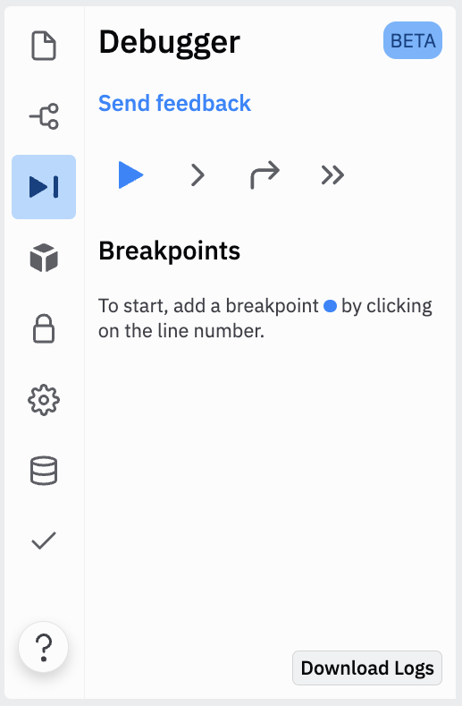
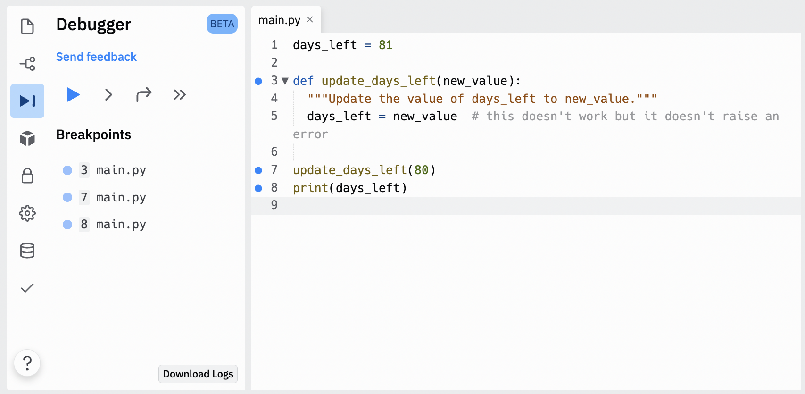
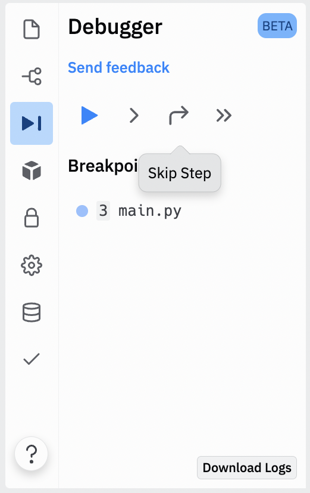
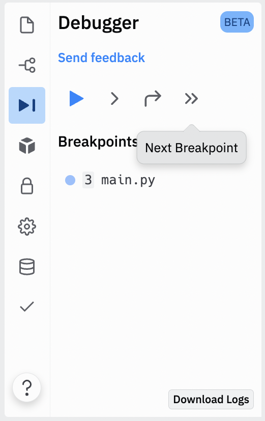
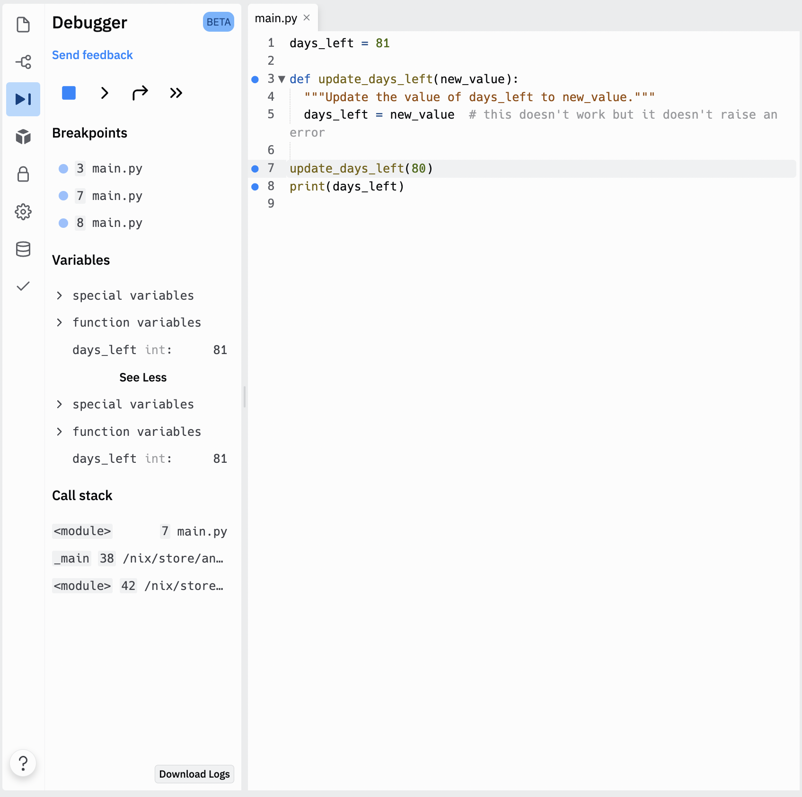

# [Link to video.](https://www.youtube.com/watch?v=GU4NXlJLwxk&list=PLVD25niNi0Bm9n4Yz3y5Li-Qc91Yflo5p&index=12)

### Debugger Tool in Replit

Many programming environments come with a **debugger tool** that helps users find bugs in their code more efficiently. Replit's debugger tool is located in the navigation bar on the left side.

When you open the debugger it lets you add **breakpoints**. A breakpoint is a line your program that debugger will stop at and analyze. To add a breakpoint, click to the left of a line number.

The breakpoints will show up in blue next to the line numbers.

Once you've added breakpoint, you can choose to run the program step by step or until it reaches the first breakpoint.

At every step and breakpoint, the debugger will tell you what variables it currently has stored. This can be used to help determine when a variable is storing the wrong value.

