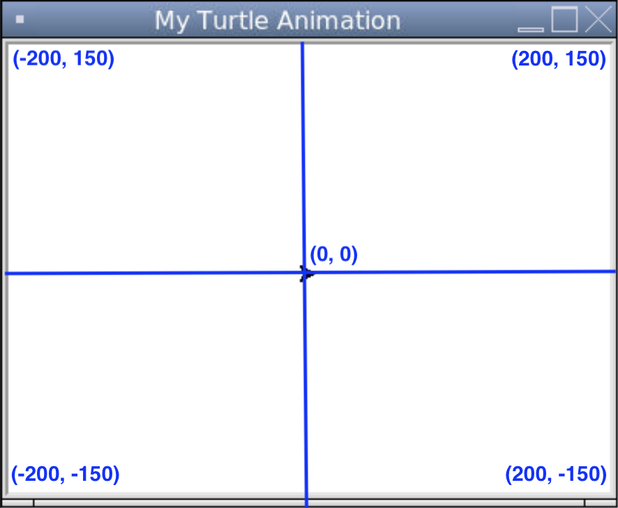
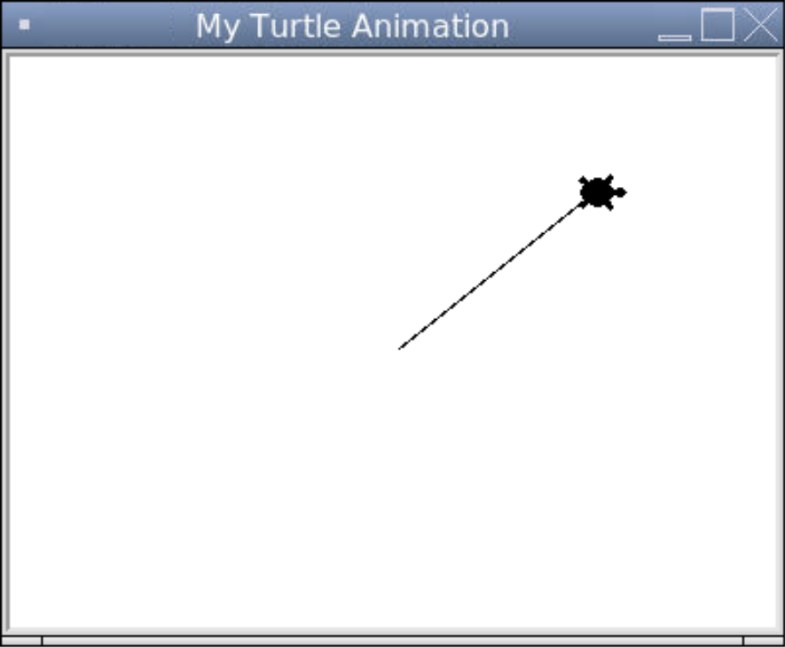
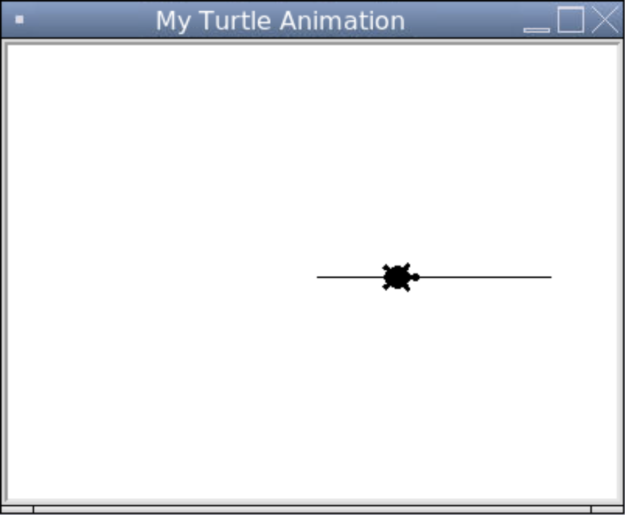
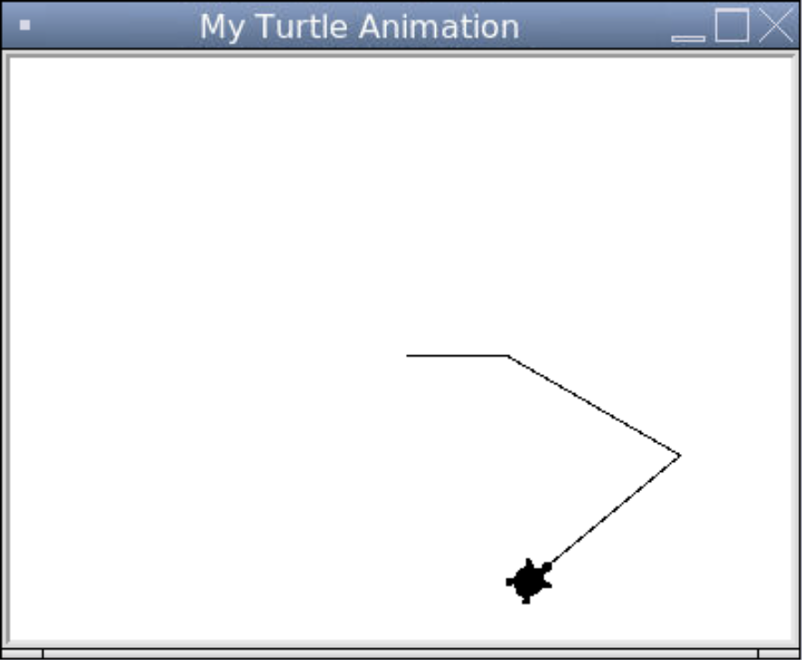
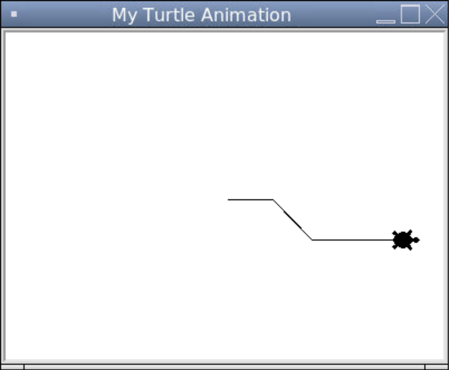
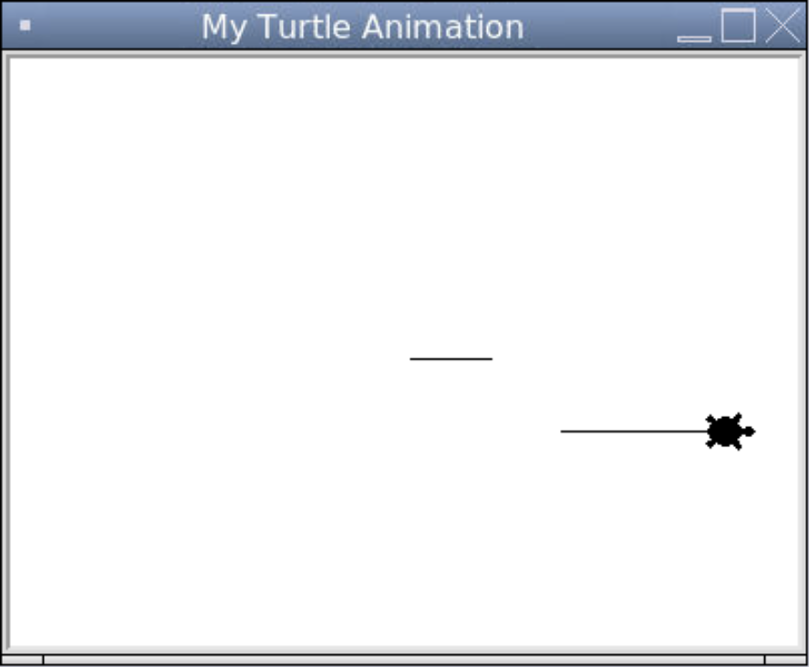
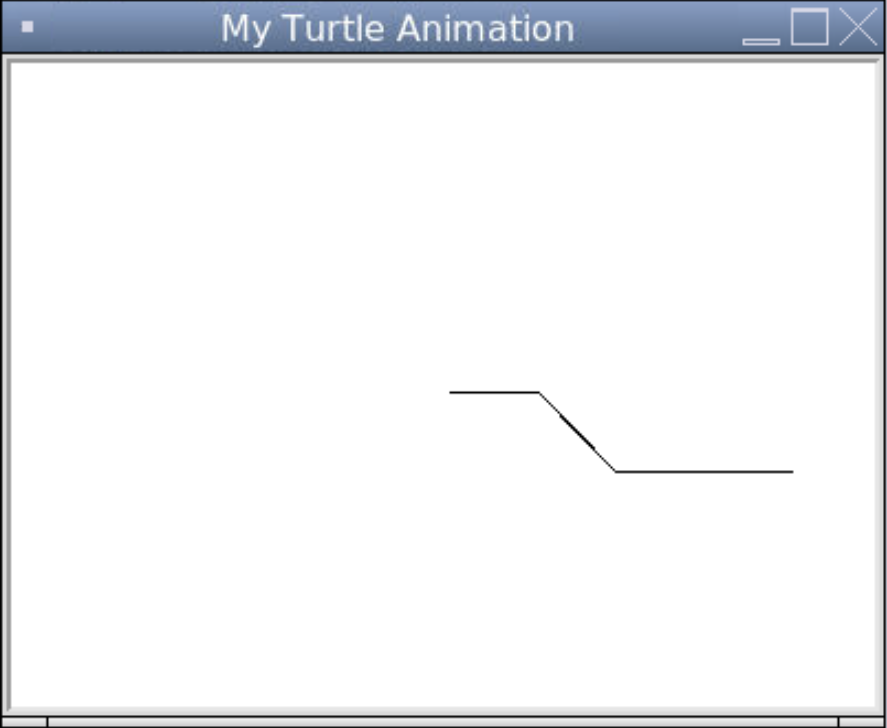

# [Link to video.](https://www.youtube.com/watch?v=mUVG0lZYx-4&list=PLVD25niNi0BkyCc47RgZHKnmIh6nsupN7)

### Movement in Turtle

The coordinate system used in Turtle is the same as the one we're familiar with from math class. 
* The x-axis is horizontal and the positive direction is towards the right.
* The y-axis is vertical and the positive direction is upwards. 
* The origin is (0, 0), the intersection of the x- and y-axis and the center of the window.

Here are the axes on a screen size of 400x300.



We can make the turtle walk to any point on the screen using the `goto()` (*go to*) function.

```python
# Importing the turtle module
from turtle import *
from turtle import _CFG  # we need this to remove the scrollers

# Resizes the default canvas size to prevent scrollers
_CFG["canvwidth"] = 1 
_CFG["canvheight"] = 1

# Creates a window with the size 400 by 300 and sets the title
setup(400, 300)
title("My Turtle Animation")

# Creates turtle shaped like a turtle
shape("turtle")

# Moves the turtle to (100, 80)
goto(100, 80)

# Keeps the program running after the drawing is complete
done()
```



The turtle's default speed is 5 on a scale of 1 (slow) to 10 (fast). We can change that using the `speed` function.

```python
# Importing the turtle module
from turtle import *
from turtle import _CFG  # we need this to remove the scrollers

# Resizes the default canvas size to prevent scrollers
_CFG["canvwidth"] = 1 
_CFG["canvheight"] = 1

# Creates a window with the size 400 by 300 and sets the title
setup(400, 300)
title("My Turtle Animation")

# Creates turtle shaped like a turtle
shape("turtle")

# Makes the turtle slower
speed(2)

# Moves the turtle to (100, 80)
goto(100, 80)

# Keeps the program running after the drawing is complete
done()
```


Rather than going to a specific point on the window, we can tell the turtle how many pixels to go forwards or backwards using `forward()` and `backward()`.

```python
# Importing the turtle module
from turtle import *
from turtle import _CFG  # we need this to remove the scrollers

# Resizes the default canvas size to prevent scrollers
_CFG["canvwidth"] = 1 
_CFG["canvheight"] = 1

# Creates a window with the size 400 by 300 and sets the title
setup(400, 300)
title("My Turtle Animation")

# Creates turtle shaped like a turtle
shape("turtle")

# Moves the turtle forwards 150 pixels then backwards 100 pixels
forward(150)
backward(100)

# Keeps the program running after the drawing is complete
done()
```



We can also make them turn clockwise or counterclockwise any number of degrees using `left()` and `right()`

```python
# Importing the turtle module
from turtle import *
from turtle import _CFG  # we need this to remove the scrollers

# Resizes the default canvas size to prevent scrollers
_CFG["canvwidth"] = 1 
_CFG["canvheight"] = 1

# Creates a window with the size 400 by 300 and sets the title
setup(400, 300)
title("My Turtle Animation")

# Creates turtle shaped like a turtle
shape("turtle")

# Moves the turtle along a path
forward(50)
right(30)
forward(100)
left(70)
backward(100)

# Keeps the program running after the drawing is complete
done()
```



If we want the turtle to go vertically or horizontally but we lose track of which direction they are facing, we can use `setheading()` to make them point a specific cardinal direction. `"0"` or `"360"` is east, `"90"` is north, `"180"` is west, and `"270"` is south.

```python
# Importing the turtle module
from turtle import *
from turtle import _CFG  # we need this to remove the scrollers

# Resizes the default canvas size to prevent scrollers
_CFG["canvwidth"] = 1 
_CFG["canvheight"] = 1

# Creates a window with the size 400 by 300 and sets the title
setup(400, 300)
title("My Turtle Animation")

# Creates turtle shaped like a turtle
shape("turtle")

# Moves the turtle in a path
forward(40)
right(46)
forward(50)
setheading(0) # makes it turn east
forward(80)

# Keeps the program running after the drawing is complete
done()
```



If we want don't want the turtle to draw a continuous line, we can use `penup()` to stop leaving a trail and `pendown()` to start leaving a trail again.

```python
# Importing the turtle module
from turtle import *
from turtle import _CFG  # we need this to remove the scrollers

# Resizes the default canvas size to prevent scrollers
_CFG["canvwidth"] = 1 
_CFG["canvheight"] = 1

# Creates a window with the size 400 by 300 and sets the title
setup(400, 300)
title("My Turtle Animation")

# Creates turtle shaped like a turtle
shape("turtle")

# Moves the turtle in a path
forward(40)
right(46)
penup() # stops drawing the trail
forward(50)
pendown() # starts drawing the trail
setheading(0)
forward(80)

# Keeps the program running after the drawing is complete
done()
```



If we want to hide and unhide the turtle, we can use `hideturtle()` and `showturtle()`.

```python
# Importing the turtle module
from turtle import *
from turtle import _CFG  # we need this to remove the scrollers

# Resizes the default canvas size to prevent scrollers
_CFG["canvwidth"] = 1 
_CFG["canvheight"] = 1

# Creates a window with the size 400 by 300 and sets the title
setup(400, 300)
title("My Turtle Animation")

# Creates turtle shaped like a turtle
shape("turtle")

# Changes the speed of the turtle to be slower
speed(2)

# Moves the turtle in a path
forward(40)
right(46)
forward(50)
setheading(0)
forward(80)
hideturtle()  # hides the turtle after they have completed the path

# Keeps the program running after the drawing is complete
done()
```


