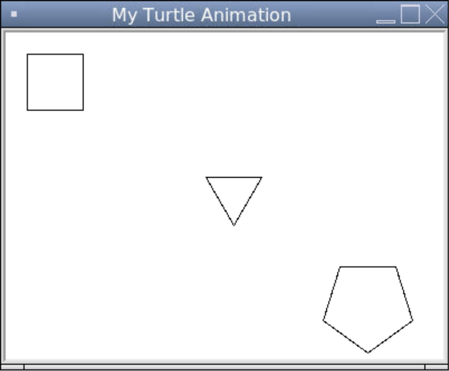
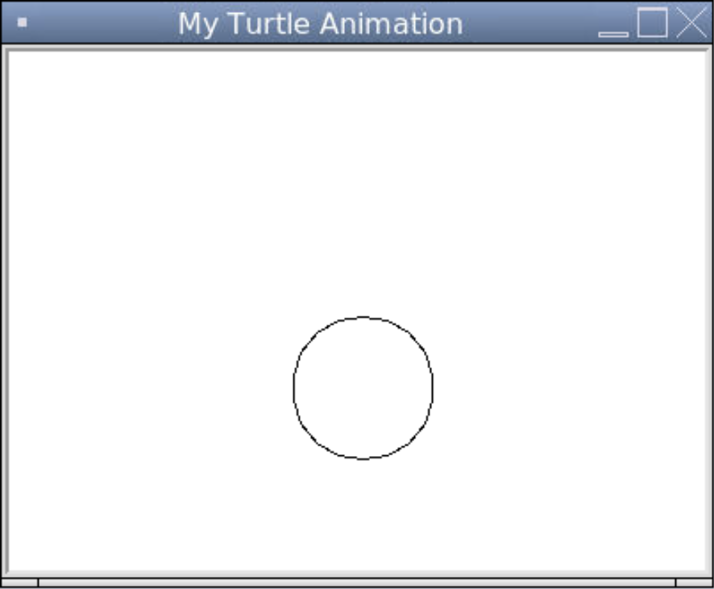
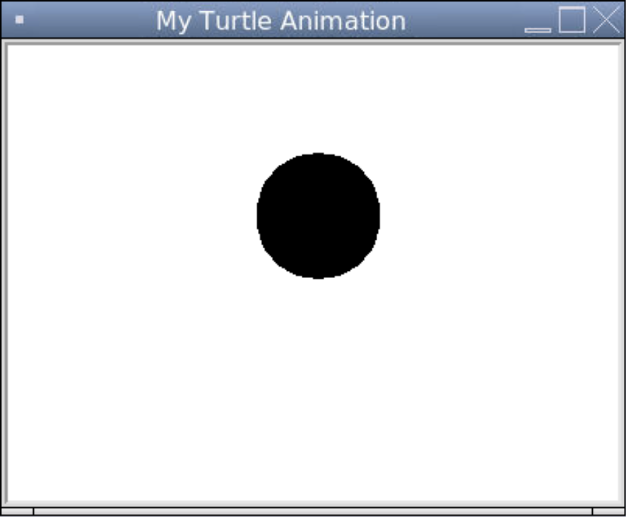

# [Link to video.](https://www.youtube.com/watch?v=PDcMSORYDcM&list=PLVD25niNi0BkyCc47RgZHKnmIh6nsupN7)

### Shapes in Turtle

We can draw polygons using just `forward()`, `left()`, and `right()`. Here are some examples of polygons.

```python
# Importing the turtle module
from turtle import *
from turtle import _CFG  # we need this to remove the scrollers

# Resizes the default canvas size to prevent scrollers
_CFG["canvwidth"] = 1 
_CFG["canvheight"] = 1

# Creates a window with the size 400 by 300 and sets the title
setup(400, 300)
title("My Turtle Animation")

# Creates turtle shaped like a turtle
shape("turtle")

# Draws a square
penup()
goto(-180, 130)
pendown()
for _ in range(4):
  forward(50)
  right(90)

# Draws a triangle
penup()
goto(-20, 20)
pendown()
for _ in range(3):
  forward(50)
  right(120)

# Draws a pentagon
penup()
goto(100, -60)
pendown()
for _ in range(5):
  forward(50)
  right(72)

# Hides the turtle after they are done drawing
hideturtle()

# Keeps the program running after the drawing is complete
done()
```



If we want to draw a circle, we can use the `circle()` function and pass the radius.

```python
# Importing the turtle module
from turtle import *
from turtle import _CFG  # we need this to remove the scrollers

# Resizes the default canvas size to prevent scrollers
_CFG["canvwidth"] = 1 
_CFG["canvheight"] = 1

# Creates a window with the size 400 by 300 and sets the title
setup(400, 300)
title("My Turtle Animation")

# Creates turtle shaped like a turtle
shape("turtle")

# Draws a circle with a radius of 40
circle(40)

# Hides the turtle after they are done drawing
hideturtle()

# Keeps the program running after the drawing is complete
done()
```


By default, the turtle goes counterclockwise to draw the circle. If we want to make it go clockwise instead, we can make the radius negative.

```python
# Importing the turtle module
from turtle import *
from turtle import _CFG  # we need this to remove the scrollers

# Resizes the default canvas size to prevent scrollers
_CFG["canvwidth"] = 1 
_CFG["canvheight"] = 1

# Creates a window with the size 400 by 300 and sets the title
setup(400, 300)
title("My Turtle Animation")

# Creates turtle shaped like a turtle
shape("turtle")

# Draws a circle (going clockwise) with a radius of 40
circle(-40)

# Hides the turtle after they are done drawing
hideturtle()

# Keeps the program running after the drawing is complete
done()
```



We can fill in a shape using `begin_fill()` and `end_fill()`. This will fill in any closed shapes created between these two function calls.

```python
# Importing the turtle module
from turtle import *
from turtle import _CFG  # we need this to remove the scrollers

# Resizes the default canvas size to prevent scrollers
_CFG["canvwidth"] = 1 
_CFG["canvheight"] = 1

# Creates a window with the size 400 by 300 and sets the title
setup(400, 300)
title("My Turtle Animation")

# Creates turtle shaped like a turtle
shape("turtle")

# Draws a black circle with a radius of 40
begin_fill()
circle(40)
end_fill()

# Hides the turtle after they are done drawing
hideturtle()

# Keeps the program running after the drawing is complete
done()
```


