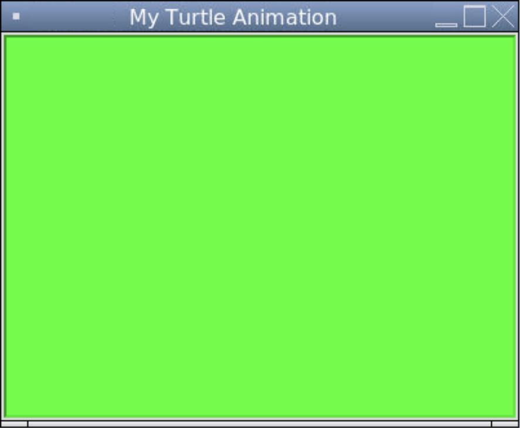
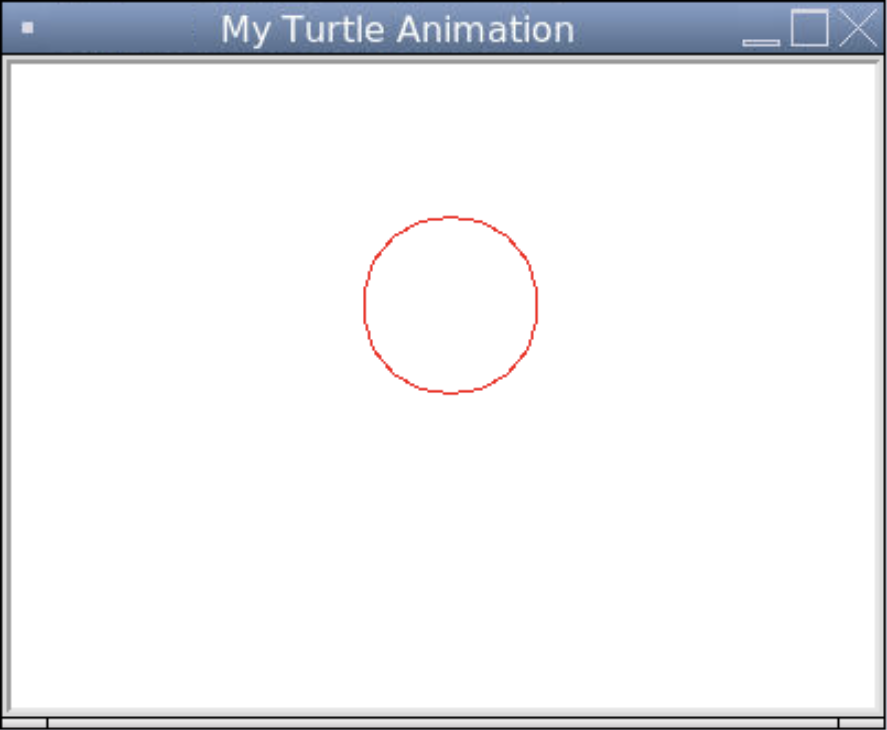
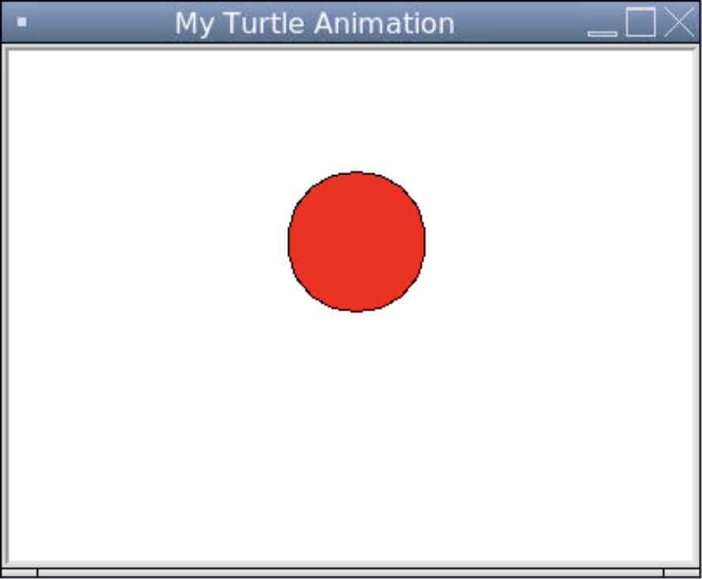
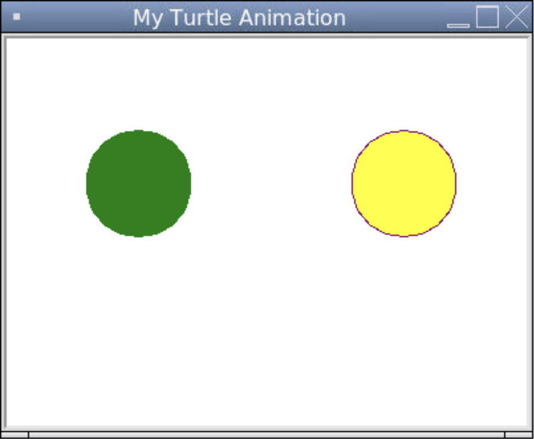

# [Link to video.](https://www.youtube.com/watch?v=N-DQgmRorxA&list=PLVD25niNi0BkyCc47RgZHKnmIh6nsupN7)

### RGB Values

All colours that can be displayed on a computer can be expressed using 24 bits. One of the most common ways to express them is using a red-green-blue (**RGB**) value. An RGB value shows how to create the colour using combinations of red, green, and blue light. It is often represented as a **tuple** in which each number is an 8-bit integer ranging from 0 to 255. A tuple is similar to a list, except it uses round brackets and we cannot change its values after we initialize it. We'll learn more details about tuples in Unit 4.

Here are the RGB values of common colours.

| Colour | RGB value       |
| ------ | --------------- |
| Black  | (0, 0, 0)       |
| White  | (255, 255, 255) |
| Red    | (255, 0, 0)     |
| Orange | (128, 127, 0)   |
| Yellow | (255, 255, 0)   |
| Green  | (0, 255, 0)     |
| Blue   | (0, 0, 255)     |
| Purple | (128, 0, 128)   |
| Pink   | (255, 192, 203) |

### Hexadecimal Values

Another common way to express a colour is using its **hexadecimal value**, or **hex value** for short. A colour's hex value can be determined by converting its RGB value. Each of the three individual values can be translated into a 2-digit hex value and we can merge them to get a 6-digit hex value. 

For example, pink's individual RGB values are 255 (#FF), 192 (#C0), 203 (#CB), so pink's hex value is #FFC0CB. The hash symbol `#` is often used to indicate that a string is a hex value.

### Colours in Turtle

All functions that take a colour as a parameter can take the colour expressed as an RBG value, a hex value, or a recognized colour name. For convenience, we can make constants for the colours we use in our program.

```python
# Initializing colours (using RGB values) so we can use them later
WHITE = (255, 255, 255)
BLACK = (0, 0, 0)
RED = (255, 0, 0)
GREEN = (0, 255, 0)
BLUE = (0, 0, 255)
```

The default colour of a screen in Turtle is white. We can change the colour of the screen using `bgcolor()` like this:

```python
# Importing the turtle module
from turtle import *
from turtle import _CFG  # we need this to remove the scrollers

# Resizes the default canvas size to prevent scrollers
_CFG["canvwidth"] = 1 
_CFG["canvheight"] = 1

# Creates a window with the size 400 by 300 and sets the title
setup(400, 300)
title("My Turtle Animation")

# Initializes the colour green as a tuple
colormode(255)
GREEN = (0, 255, 0)

# Makes the background of the window green
bgcolor(GREEN)

# Keeps the program running after the drawing is complete
done()
```



Turtle also recognizes [most of these colour names](https://www.tcl.tk/man/tcl/TkCmd/colors.html). To use any of them, we just write the name as a string.

```python
# Importing the turtle module
from turtle import *
from turtle import _CFG  # we need this to remove the scrollers

# Resizes the default canvas size to prevent scrollers
_CFG["canvwidth"] = 1 
_CFG["canvheight"] = 1

# Creates a window with the size 400 by 300 and sets the title
setup(400, 300)
title("My Turtle Animation")

# Sets the background of the window to be the colour called "green1" (from the list of recognized colour names)
bgcolor("green1")

# Keeps the program running after the drawing is complete
done()
```


To change the colour of the trail, we can use `pencolor()`.

```python
# Importing the turtle module
from turtle import *
from turtle import _CFG  # we need this to remove the scrollers

# Resizes the default canvas size to prevent scrollers
_CFG["canvwidth"] = 1 
_CFG["canvheight"] = 1

# Creates a window with the size 400 by 300 and sets the title
setup(400, 300)
title("My Turtle Animation")

# Draws a circle with a radius of 40 with a red border
pencolor("red")
circle(40)

# Keeps the program running after the drawing is complete
done()
```



To change the colour of the fill, we can use `fillcolor()`.


```python
# Importing the turtle module
from turtle import *
from turtle import _CFG  # we need this to remove the scrollers

# Resizes the default canvas size to prevent scrollers
_CFG["canvwidth"] = 1 
_CFG["canvheight"] = 1

# Creates a window with the size 400 by 300 and sets the title
setup(400, 300)
title("My Turtle Animation")

# Draws a red circle with a radius of 40 with a black border
fillcolor("red")
begin_fill()
circle(40)
end_fill()

# Keeps the program running after the drawing is complete
done()
```



To change the trail colour and fill colour at the same time, we can use `color()`. If we just give one colour it will be for both, but if we give two colours the first colour will be for the trail and the second colour will be for the fill.

```python
# Importing the turtle module
from turtle import *
from turtle import _CFG  # we need this to remove the scrollers

# Resizes the default canvas size to prevent scrollers
_CFG["canvwidth"] = 1 
_CFG["canvheight"] = 1

# Creates a window with the size 400 by 300 and sets the title
setup(400, 300)
title("My Turtle Animation")

# Draws a green circle
penup()
goto(-100, 0)
pendown()
color("green")
begin_fill()
circle(40)
end_fill()

# Draws a purple-yellow circle
penup()
goto(100, 0)
pendown()
color("purple", "yellow")
begin_fill()
circle(40)
end_fill()

# Keeps the program running after the drawing is complete
done()
```



