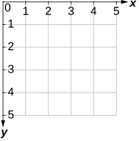

# Link to video.

### Tkinter

Tkinter (pronounced "tee-kinter" or "tuh-kinter" or "tee-kay-inter", short for *Tk interface*) is a package in the Python Standard Library. Tkinter is the de facto package used to create GUIs (graphic user interfaces) in Python. A GUI (pronounced "gooey") is a way of interacting with a computer. Examples of GUIs include windows, icons, and menus.

There are a few lines of code that we need to include in every Tkinter program.

```python
# Importing Tkinter
from tkinter import *

# Creates the window
Tk()

# Keeps the program running and updating
mainloop()
```

1. We first need to import the `tkinter` package.
2. We then need to use the `Tk()` constructor to create a window to put the graphics on.
3. Lastly, we need to call `mainloop()` to keep the window displaying until we close the window or hit the Stop button.

Here is the result of this program.


By default, the title of the window in the title bar in Replit is "tk". We can change that using the `title()` method on the window.


### Screen Coordinates

The coordinate system in programming are often different than the coordinate system used in math. 

In math, 2-dimensional coordinates can be graphed on a Cartesian Plane like this:


In computer science, we don't use the Cartesian plane for coordinates very often. We usually use this coordinate system instead:



For example, if we are referring to a specific pixel in an image, we would use this coordinate system instead of the Cartesian plane. 

The idea is that this is similar to how we would refer to cells in a table: the row number followed by column number, with *row 0, column 0* representing the cell in the top-left corner. This is also similar to how we read in English: left to right, top to bottom.

The coordinate (0, 0) is referred to as the **origin**. In math, the origin is at the center of the Cartesian plane. If we are only using the positive quadrant of the Cartesian plane, the origin is at the bottom-left corner. In Tkinter, **the origin is always is at the top-left corner**. 


### Official Documentation

Here is the official documentation for Tkinter: https://docs.python.org/3/library/tkinter.html.
