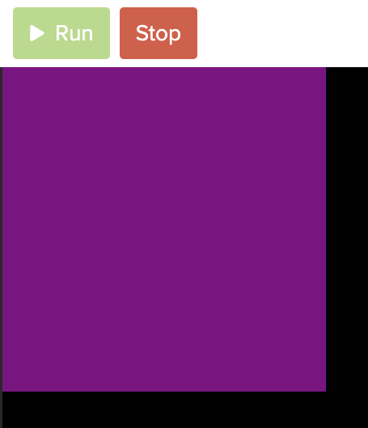
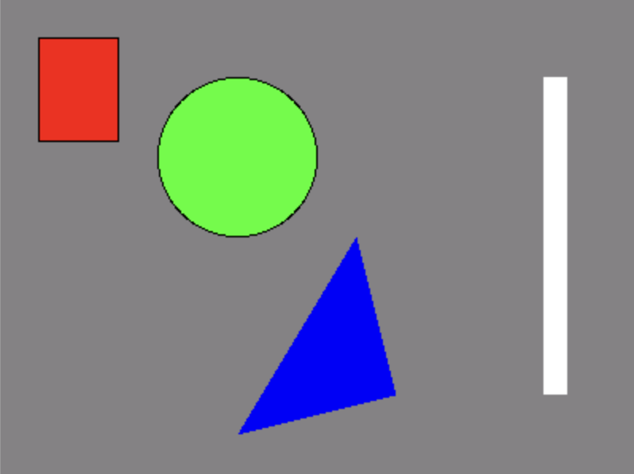
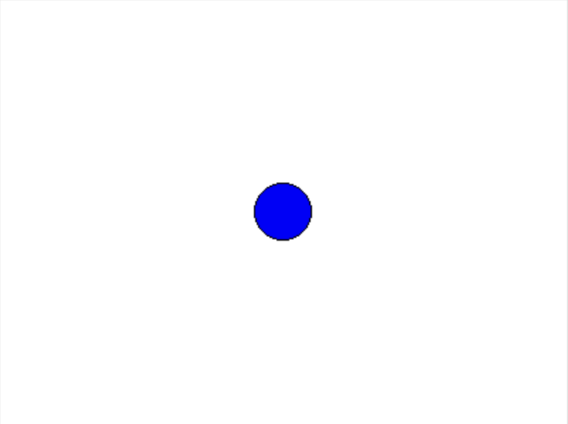

# Link to video.

### Tkinter Canvas

In order to draw shapes in Tkinter, we need to put a canvas on the window. We use the `Canvas()` constructor to create the canvas and pass the window as an argument. We could also pass keyword arguments including `width` (width of the canvas), `height` (height of the canvas), and `background` (background colour). Then we use the `pack()` method on the canvas. This resizes the window to fit the canvas and also displays the canvas. 

```python
from tkinter import *

# Creates the window and canvas
window = Tk()
canvas = Canvas(window, width = 400, height = 300, background = "purple") # creates a purple canvas that is 400px by 300px that will go on the window
canvas.pack()  # puts the canvas on the window and adjusts the size of the window accordingly

# Keeps the program running and updating
mainloop()
```


### Shapes in Tkinter

Now we can draw shapes on the canvas using the following methods. 
* `create_line()`
  * The parameters are `(x1, y1, x2, y2)` where the line begins at (x1, y1) and ends at (x2, y2)
* `create_rectangle()`
  * The parameters are `(x1, y1, x2, y2)` where the top-left corner is at (x1, y1) and the bottom-right corner is at (x2, y2)
* `create_oval()`
  * The parameters are `(x1, y1, x2, y2)` where the top-left "corner" is at (x1, y1) and the bottom-right "corner" is at (x2, y2)
* `create_polygon()`
  * The parameters are `(x1, y1, x2, y2, x3, y3, ...)` where each corner is at (xn, yn) where n is the corner number

These methods also take keyword arguments. Some of the keyword arguments include:
* `fill` for the interior colour of the shape
* `outline` for the colour of the shape's border
* `width` for the thickness of the shape's border, in pixels

Here are a few examples of drawing shapes:

```python
from tkinter import *

# Creates the window and canvas
window = Tk()
canvas = Canvas(window, width = 400, height = 300, background = "grey") # creates a canvas that is 400px by 300px that will go on the window
canvas.pack()  # puts the canvas on the window and adjusts the size of the window accordingly

# Draws a green circle
canvas.create_oval(100, 50, 200, 150, fill = "green1") # 'green1' is (0, 255, 0) whereas 'green' is (0, 128, 0)

# Draws a red rectangle
canvas.create_rectangle(25, 25, 75, 90, fill = "red")

# Draws a blue triangle
canvas.create_polygon(250, 250, 225, 150, 150, 275, fill = "blue")

# Draws a white line
canvas.create_line(350, 50, 350, 250, fill = "white", width = 15)

# Keeps the program running and updating
mainloop()
```

The shapes above look like this:



Since drawing a circle based on its top-left and bottom-right corners isn't always convenient, here's a function to calculate the corners based on its center and radius.

```python
# Helper function for drawing a circle
def circle_corners(x, y, r):
  """Returns a tuple of the top-left and bottom-right corners of a circle based on its center coordinates and its radius."""
  x0 = x - r
  y0 = y - r
  x1 = x + r
  y1 = y + r
  return (x0, y0, x1, y1)
```

And here's an example on how to use it.

```python
from tkinter import *

# The size of the canvas
WIDTH = 400
HEIGHT = 300

# Creates the window and canvas
window = Tk()
canvas = Canvas(window, width = WIDTH, height = HEIGHT, background = "white")
canvas.pack()

# Helper function for drawing a circle
def circle_corners(x, y, r):
  """Returns a tuple of the top-left and bottom-right corners of a circle based on its center coordinates and its radius."""
  x1 = x - r
  y1 = y - r
  x2 = x + r
  y2 = y + r
  return (x1, y1, x2, y2)

# The circle
circle_x = WIDTH/2
circle_y = HEIGHT/2
circle_radius = 20
circle_corners = circle_corners(circle_x, circle_y, circle_radius)
canvas.create_oval(circle_corners[0], circle_corners[1], circle_corners[2], circle_corners[3], fill = "blue")

# Keeps the program running and updating
mainloop()
```


