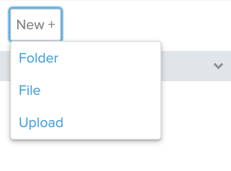
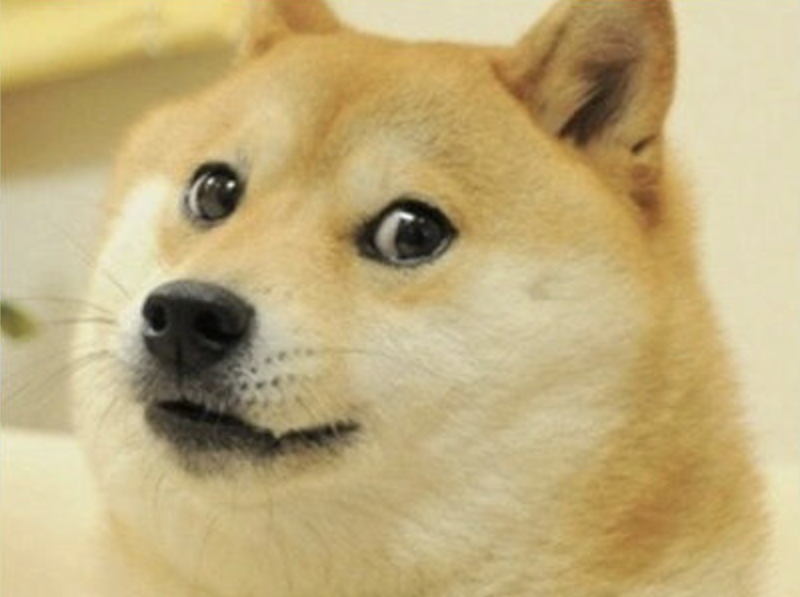
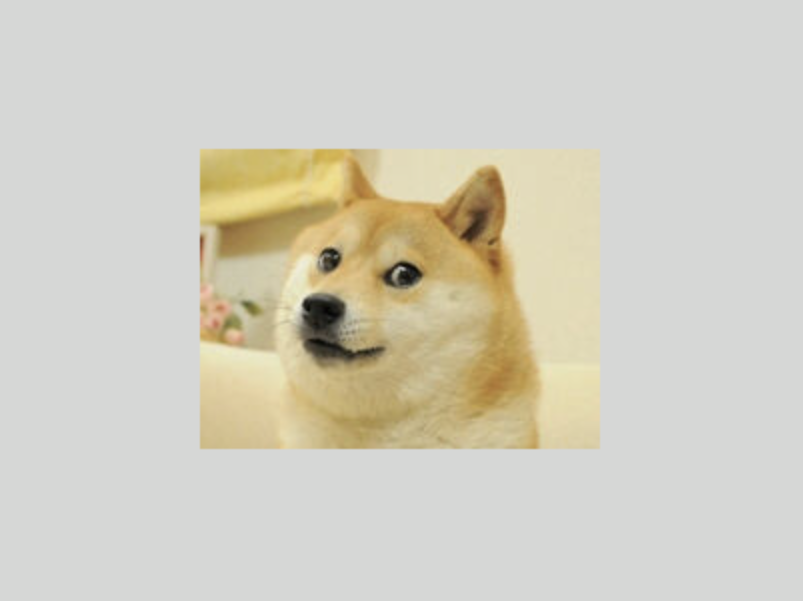

# [Link to video.](https://www.youtube.com/watch?v=ynnYWEvH1KY&list=PLVD25niNi0BnsKwMvXId8jFMXxC1wUbko)

### Images in Tkinter

We can upload files to CodeHS programs by clicking on New+ in the left pane.



`PIL` is short for *Python Imaging Library*. It's a module that's compatible with Tkinter. We can open image files using `Image.open()` and save them as image objects using `ImageTk.PhotoImage()`.

We can place images on a canvas using `create_image()`. The parameters are `x` and `y` (the x- and y-coordinates of the center of the image), followed by the keyword arguments including `image`.

```python
from tkinter import *
from PIL import Image, ImageTk

# creates the window
window = Tk()

# sets the size of the canvas
WIDTH = 400
HEIGHT = 300

# creates the canvas for the image to go on
canvas = Canvas(window, width=WIDTH, height=HEIGHT)
canvas.pack()

# loads the meme image as a PhotoImage
doge = ImageTk.PhotoImage(Image.open("doge.png"))

# puts the image onto the screen
canvas.create_image(WIDTH/2, HEIGHT/2, image=doge)

# keeps the program running and updating
mainloop()
```



With `PIL`, we can also freely modify the dimensions of an image. We first create an `Image`, then we use the `resize()` method, then we create a `PhotoImage`.

```python
from tkinter import *
from PIL import Image, ImageTk

# creates the window
window = Tk()

# sets the size of the canvas
WIDTH = 400
HEIGHT = 300

# creates the canvas for the image to go on
canvas = Canvas(window, width=WIDTH, height=HEIGHT)
canvas.pack()

# loads the image as an Image, resizes it, and makes it a PhotoImage
doge = Image.open("doge.png")
doge = doge.resize((200, 150))
doge = ImageTk.PhotoImage(doge)

# puts the image onto the screen
canvas.create_image(WIDTH/2, HEIGHT/2, image=doge)

# keeps the program running and updating
mainloop()
```


