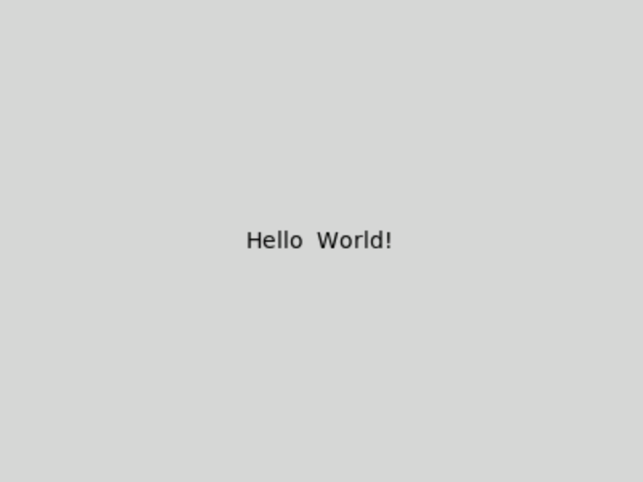
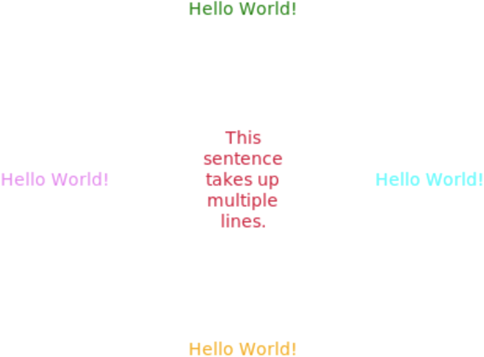
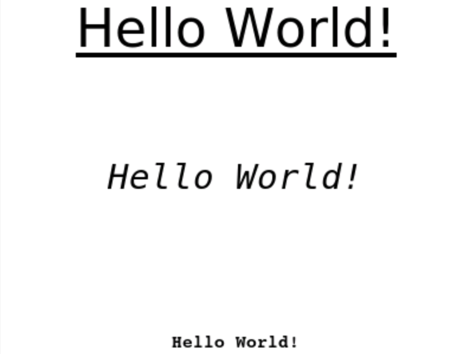

# [Link to video.](https://www.youtube.com/watch?v=IVHTqq9V9cA&list=PLVD25niNi0BnqxVm1TDHLvdHOM3FDaV36&index=6)

### Text in Tkinter 

We can place text on a canvas using `create_text()`. The parameters are `x` and `y` (the x- and y-coordinates of the center of the image), followed by keyword arguments including `text`, which takes a string. 

```python
from tkinter import *

# Creates the window
window = Tk()

# The size of the canvas
WIDTH = 400
HEIGHT = 300

# Creates the canvas for the image and text to go on
canvas = Canvas(window, width = WIDTH, height = HEIGHT)
canvas.pack()

# Puts text on the canvas
canvas.create_text(WIDTH/2, HEIGHT/2, text = "Hello  World!")

# Keeps the program running and updating
mainloop()
```



Other keyword arguments for `create_text()` include:

* `anchor` for the position of (x, y)
* `fill` for the colour of the text
* `width` for the maximum length of the line
* `justify` for the text alignment of multi-line texts
* `font` as a tuple (see the section below)

The values for `anchor` are based on cardinal directions (north, east, south, west): `"n"`, `"e"`, `"s"`, `"w"`, `"ne"`, `"se"`, `"nw"`, `"sw"`, `center` (default).
The values for `justify` are built-in constants: `LEFT` (default), `CENTER`, `RIGHT`.

```python
from tkinter import *

# Creates the window
window = Tk()

# The size of the canvas
WIDTH = 400
HEIGHT = 300

# Creates the canvas for the image and text to go on
canvas = Canvas(window, width = WIDTH, height = HEIGHT, background = "white")
canvas.pack()

# Puts texts on the canvas
canvas.create_text(WIDTH/2, 0, text = "Hello World!", fill = "green", anchor = "n")
canvas.create_text(WIDTH, HEIGHT/2, text = "Hello World!", fill = "aqua", anchor = "e")
canvas.create_text(WIDTH/2, HEIGHT, text = "Hello World!", fill = "orange", anchor = "s")
canvas.create_text(0, HEIGHT/2, text = "Hello World!", fill = "violet", anchor = "w", )
canvas.create_text(WIDTH/2, HEIGHT/2, text = "This sentence takes up multiple lines.", fill = "crimson", width = 70, justify = CENTER)

# Keeps the program running and updating
mainloop()
```



### Fonts and Text Styling in Tkinter 

We can access some fonts depending on the operating system and/or IDE.

The full list of fonts can be found with `families()` from the `font` module. Here are the fonts we can access on Replit. The line `from tkinter import font` is needed since the line `from tkinter import *` only imports classes, functions, and variables (not modules) from Tkinter.

```python
from tkinter import *
from tkinter import font

Tk()

print(list(font.families()))

mainloop()
```

```
['DejaVu Math TeX Gyre', 'DejaVu Sans Mono', 'DejaVu Sans', 'DejaVu Sans', 'DejaVu Serif', 'Bitstream Charter', 'DejaVu Sans', 'Courier 10 Pitch', 'DejaVu Serif']
```

Unfortunately, those are all the choices we have in CodeHS. Tkinter does not support using external fonts. 

When we use `create_text()`, we can use the keyword argument `font` to change the font family, font size, and font styling. The options for the font styling are the following:
* `"underline"`
* `"italic"`
* `"bold"`
* `"bold italic"`
* `"bold underline"`
* `"italic underline"`
* `"bold italic underline"`

```python
from tkinter import *

# Creates the window
window = Tk()

# The size of the canvas
WIDTH = 400
HEIGHT = 300

# Creates the canvas for the image and text to go on
canvas = Canvas(window, width = WIDTH, height = HEIGHT, background = "white")
canvas.pack()

# Puts texts on the canvas
canvas.create_text(WIDTH/2, 0, text = "Hello World!", anchor = "n", font = ("DejaVu Sans", 30, "underline"))
canvas.create_text(WIDTH/2, HEIGHT/2, text = "Hello World!", font = ("DejaVu Sans Mono", 20, "italic"))
canvas.create_text(WIDTH/2, HEIGHT, text = "Hello World!", anchor = "s", font = ("Courier 10 Pitch", 10, "bold"))

# Keeps the program running and updating
mainloop()
```


