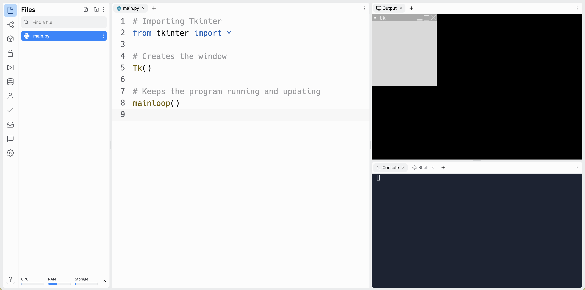
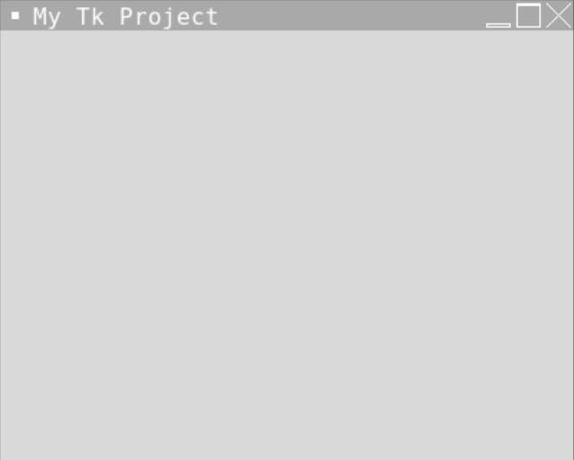

# [Link to video.](https://www.youtube.com/watch?v=xtRNSzdBsl4&list=PLVD25niNi0BlwZxjcVF6-vcOdAicWlRjC)

### Tkinter

Tkinter (pronounced "tee-kinter" or "tuh-kinter" or "tee-kay-inter", short for *Tk interface*) is a package in the Python Standard Library. Tkinter is the de facto package used to create GUIs (graphic user interfaces) in Python. A GUI (pronounced "gooey") is a way of interacting with a computer. Examples of GUIs include windows, icons, and menus.

There are a few lines of code that we need to include in every Tkinter program.

```python
# Importing Tkinter
from tkinter import *

# Creates the window
Tk()

# Keeps the program running and updating
mainloop()
```

1. We first need to import the `tkinter` package.
2. We then need to use the `Tk()` constructor to create a window to put the graphics on.
3. Lastly, we need to call `mainloop()` to keep the window displaying until we close the window or hit the Stop button.

Here is the result of this program.



By default, the title of the window in the title bar in Replit is "tk". We can change that using the `title()` method on the window. We can also change the size of the window using the `geometry` method.

```python
# Importing Tkinter
from tkinter import *

# Creates the window
window = Tk()

# Sets the title in the title bar
window.title("My Tk Project")

# Changes the size of the window to 400 pixels by 400 pixels
window.geometry("400x400")

# Keeps the program running and updating
mainloop()
```



### Official Documentation

Here is the official documentation for Tkinter: https://docs.python.org/3/library/tkinter.html.
