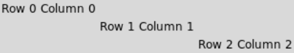
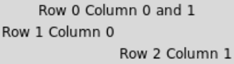

# [Link to video.](https://www.youtube.com/watch?v=MQvWrXPeatw&list=PLVD25niNi0BnsKwMvXId8jFMXxC1wUbko)

### The Grid System

If we use `grid()` instead of `pack()`, the widgets are arranged in a grid system. Properties of the `grid()` method include `row` for the row number (starting at 0) and `column` for the column number (starting at 0). Blank rows and blank columns take up no space where as occupied cells take up the minimum amount of space needed.

```python
from tkinter import *

# Creates the window 
window = Tk()

# Creates labels for some text to go on
label00 = Label(window, text="Row 0 Column 0")
label00.grid(row=0, column=0)

label11 = Label(window, text = "Row 1 Column 1") 
label11.grid(row=1, column=1)

label22 = Label(window, text = "Row 2 Column 2")
label22.grid(row=2, column=2)  

# Keeps the program running and updating
mainloop()
```



If we want to merge cells together, we can use the `columnspan` property to indicate how many horizontally-adjacent cells to merge together.

```python
from tkinter import *

# Creates the window 
window = Tk()

# Creates labels for some text to go on
label00 = Label(window, text = "Row 0 Column 0 and 1")
label00.grid(row=0, column=0, columnspan=2)

label10 = Label(window, text = "Row 1 Column 0")
label10.grid(row=1, column=0)

label21 = Label(window, text = "Row 2 Column 1")
label21.grid(row=2, column=1)

# Keeps the program running and updating
mainloop()
```


