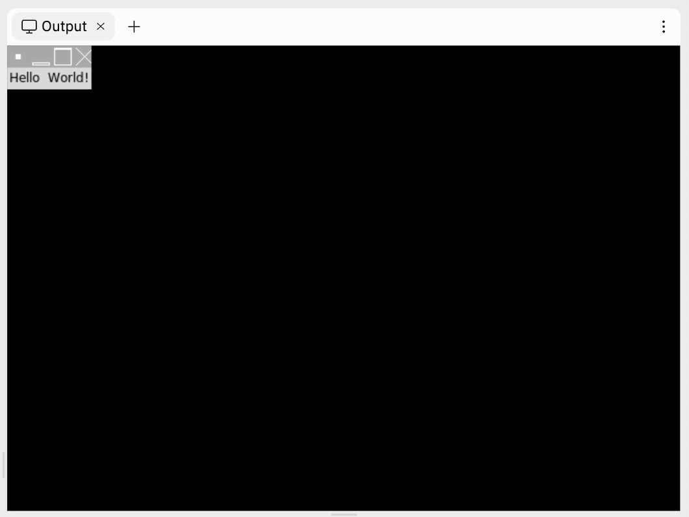
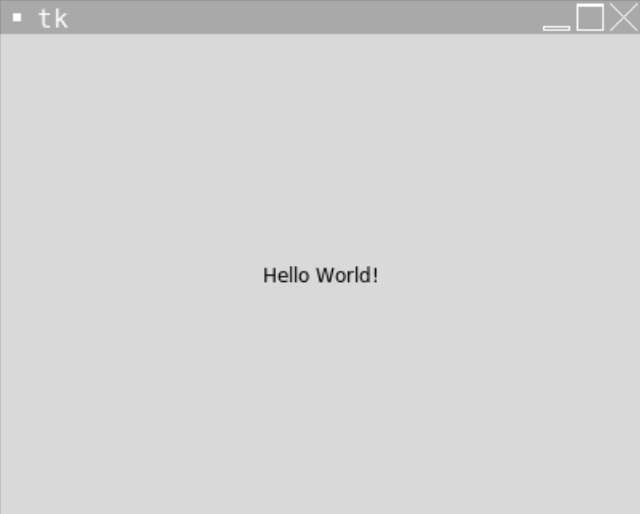
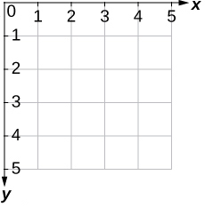

# [Link to video.](https://www.youtube.com/watch?v=lr6A0S7SLAI&list=PLVD25niNi0BlwZxjcVF6-vcOdAicWlRjC&index=4)

### Widgets in Tkinter

A **widget** is an individual element of a GUI. Tkinter widgets include labels, buttons, text boxes, checkboxes, radio buttons, scales, dropdown menus, message boxes, and so on.  

When we create these widgets using a constructor, we pass the window and a variety of keyword arguments representing **properties** of the widget.

### The Packing System

Once we create a widget, we still have to place it onto the window. We can do so using the `pack()` method or `grid()` method. We have to pick one of them to use consistently in a program – we can't use `pack()` on some widgets and `grid()` on other widgets in the same program. 

When we use `pack()` with the default window size, the window will take up the minimum size needed to fit the widgets. 

```python
from tkinter import *

# Creates the window
window = Tk()

# Creates a label for some text to go on
label = Label(window, text = "Hello  World!")  # creates the label
label.pack()  # puts the label on the window and adjusts the size of the window accordingly

# Keeps the program running and updating
mainloop()
```



If we instead want the window to be a fixed size, we can use the `geometry()` method, which takes a string in the form `"widthxheight"`, such as `"400x300"`. When we do that, we can pick the coordinates of the widget using the `place()` method after we call `pack()`. Properties of the `place()` method include `x` for the x-coordinate and `y` for the y-coordinate.

```python
from tkinter import *

# The size of the window
WIDTH = 400
HEIGHT = 300

# Creates the window that's 400 pixels by 300 pixels
window = Tk()
window.geometry(str(WIDTH) + "x" + str(HEIGHT))

# Creates a label for some text to go on
label = Label(window, text = "Hello World!")  # creates the label
label.pack()  # puts the label on the window
label.place(x = WIDTH/2, y = HEIGHT/2, anchor = "center") # puts the label at the center of the window

# Keeps the program running and updating
mainloop()
```



### f-strings

In Python, we can use **string prefixes** to modify the way strings are displayed.

Consider the following line from the program above:

```python
window.geometry(str(WIDTH) + "x" + str(HEIGHT))
```

We can improve the readability by formatting the string using an **f-prefix** (the *f* stands for *format*). To use an f-prefix, we place an `f` in front of the opening quotation mark and enclose variable names in curly braces inside the string.

```python
window.geometry(f"{WIDTH}x{HEIGHT}")  # this is an f-prefix
```

### Screen Coordinates in Tkinter

The coordinate system in programming are often different than the coordinate system used in math. 

In math, 2-dimensional coordinates can be graphed on a Cartesian Plane like this:


In computer science, we don't use the Cartesian plane for coordinates very often. We usually use this coordinate system instead:



For example, if we are referring to a specific pixel in an image, we would use this coordinate system instead of the Cartesian plane. 

The idea is that this is similar to how we would refer to cells in a table: the row number followed by column number, with *row 0, column 0* representing the cell in the top-left corner. This is also similar to how we read in English: left to right, top to bottom.

The coordinate (0, 0) is referred to as the **origin**. In math, the origin is at the center of the Cartesian plane. If we are only using the positive quadrant of the Cartesian plane, the origin is at the bottom-left corner. In Tkinter, **the origin is always is at the top-left corner**. 
