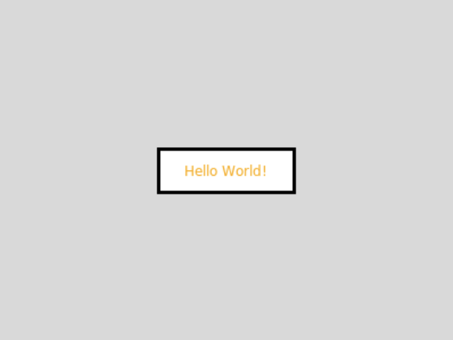

# [Link to video.](https://www.youtube.com/watch?v=Pts43M6R5kM&list=PLVD25niNi0BnsKwMvXId8jFMXxC1wUbko)

### Labels in Tkinter

A `Label` is a widget used to put text onto a window.

Here are some of the properties of `Label`:
* `text`
* `image` 
* `anchor`
* `background` (same as `bg`)
* `foreground` (same as `fg`)
* `padx` (the number of pixels to the left and right of the label before the border)
* `pady` (the number of pixels above and below the label before the border)
* `relief` (the type of border: `"solid"`, `"groove"`, `"ridge"`, etc.)
* `borderwidth`
* `width` (only when `text` is used, the number of *characters* per line)
* `height` (only when `text` is used, the number of lines)
* `justify` (only when `text` is used)
* `font` (only when `text` is used)

Here's an example of a label containing text with a lot of custom properties.

```python
from tkinter import *

# size of the window
WIDTH = 400
HEIGHT = 300

# creates the window that's 400 pixels by 300 pixels
window = Tk()
window.geometry(f"{WIDTH}x{HEIGHT}")

# creates a label for some text to go on
label = Label(window, text="Hello World!", fg="orange", bg="white", borderwidth=3, relief="solid", padx=10, pady=10, width=12)  # creates the label
label.pack()  # puts the label on the window
label.place(x=WIDTH/2, y=HEIGHT/2, anchor="center") # moves the label to the middle of the window

# keeps the program running and updating
mainloop()
```



### Fonts and Text Styling in Tkinter 

Here's an example of adding apply a font to a label:

```python
label = Label(window, text="Hello World!", font=("DejaVu Sans", 30, "bold")) # font size
```


