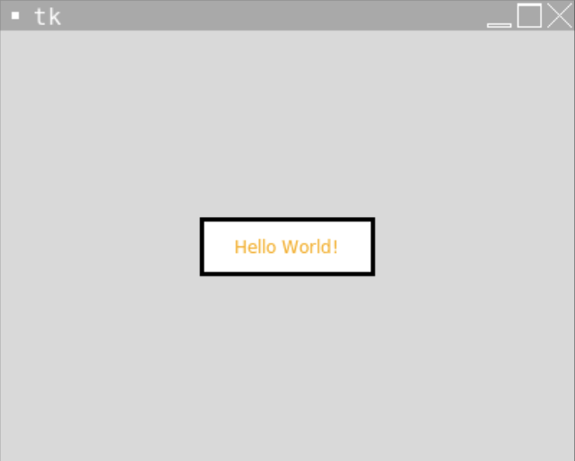
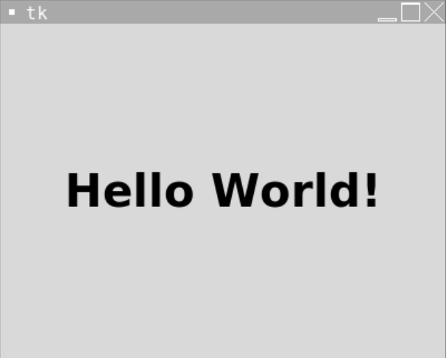

# [Link to video.](https://www.youtube.com/watch?v=7BsC_OcmfqY&list=PLVD25niNi0BlwZxjcVF6-vcOdAicWlRjC)

### Labels in Tkinter

A `Label` is a widget used to put text onto a window.

Here are some of the properties of `Label`:
* `text`
* `image` 
* `anchor`
* `background` (same as `bg`)
* `foreground` (same as `fg`, similar to `fill`)
* `padx` (the number of pixels to the left and right of the label before the border)
* `pady` (the number of pixels above and below the label before the border)
* `relief` (the type of border: `"solid"`, `"groove"`, `"ridge"`, etc.)
* `borderwidth`
* `width` (only when `text` is used, the number of *characters* per line)
* `height` (only when `text` is used, the number of lines)
* `justify` (only when `text` is used)
* `font` (only when `text` is used)

Here's an example of a label containing text with a lot of custom properties.

```python
from tkinter import *

# The size of the window
WIDTH = 400
HEIGHT = 300

# Creates the window that's 400 pixels by 300 pixels
window = Tk()
window.geometry(f"{WIDTH}x{HEIGHT}")

# Creates a label for some text to go on
label = Label(window, text = "Hello World!", foreground = "orange", background = "white", borderwidth = 3, relief = "solid", padx = 10, pady = 10, width = 12)  # creates the label
label.pack()  # puts the label on the window
label.place(x = WIDTH/2, y = HEIGHT/2, anchor = "center") # moves the label to the middle of the window

# Keeps the program running and updating
mainloop()
```



### Fonts and Text Styling in Tkinter 

We can access some fonts depending on the operating system and/or IDE.

The full list of fonts can be found with `families()` from the `font` module. Here are the fonts we can access on Replit. The line `from tkinter import font` is needed since the line `from tkinter import *` only imports classes, functions, and variables (not modules) from Tkinter.

```python
from tkinter import *
from tkinter import font

Tk()

print(list(font.families()))

mainloop()
```

```
> ['DejaVu Sans Mono', 'FreeSerif', 'DejaVu Sans', 'FreeSans', 'DejaVu Serif', 'FreeMono']
```

Unfortunately, those are all the choices we have in Replit. Tkinter does not support using external fonts. 

The options for the font styling are the following:
* `"underline"`
* `"italic"`
* `"bold"`
* `"bold italic"`
* `"bold underline"`
* `"italic underline"`
* `"bold italic underline"`

Here's an example of adding apply a font to a label:

```python
label = Label(window, text = "Hello World!", font = ("DejaVu Sans", 30, "bold")) # font size
```



