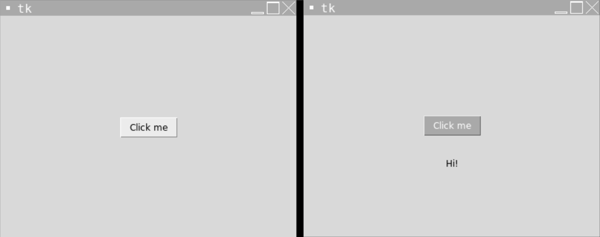
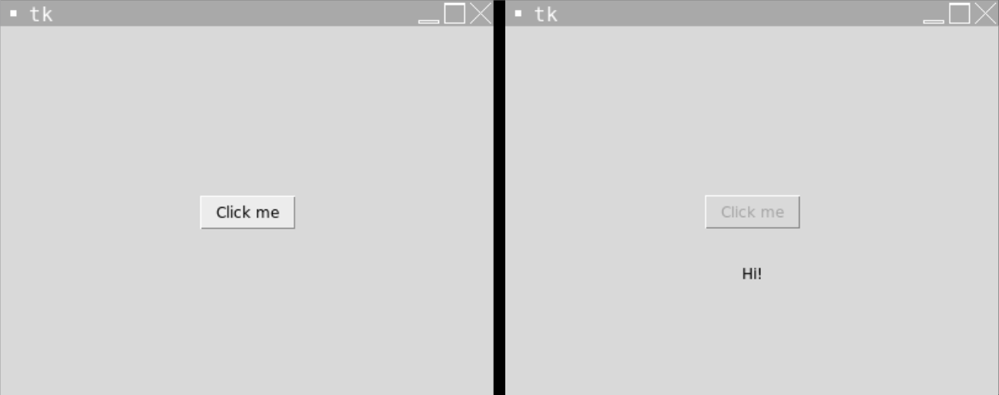
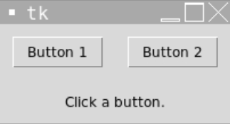

# [Link to video.](https://www.youtube.com/watch?v=3JIrIcnuc78&list=PLVD25niNi0BlwZxjcVF6-vcOdAicWlRjC)

### Buttons in Tkinter

We can create clickable buttons using the `Button` widget. All of the properties we saw with `Label` also work with `Button`.

Here are some other properties of `Button`:
* `command` (the function that gets called when the button is clicked)
* `state` (the button can be `"normal"`, `"disabled"`, or "`active"`)

Here is an example of a button that puts "Hi" on the window when it is clicked.

```python
from tkinter import *

# The size of the window
WIDTH = 400
HEIGHT = 300

# Creates the window that's 400 pixels by 300 pixels
window = Tk()
window.geometry(f"{WIDTH}x{HEIGHT}")

# The function that's called when the button is clicked
def print_hi():
  """Creates a label that says 'Hi!' under the button."""
  hi_label = Label(window, text = "Hi!")
  hi_label.pack()
  hi_label.place(x = WIDTH/2, y = HEIGHT/2 + 50, anchor = "center")

# Creates a button with some text on it
button = Button(window, text = "Click me", foreground = "white", background = "dark grey", command = print_hi)  # creates the button
button.pack()  # puts the button on the window
button.place(x = WIDTH/2, y = HEIGHT/2, anchor = "center") # moves the button to the middle of the window

# Keeps the program running and updating
mainloop()
```



### Disabling Buttons

We can disable a button by setting the `"state"` property to `"disabled"`. This greys out the text on it as a visual cue that it can't be pressed. 

```python
from tkinter import *

# The size of the window
WIDTH = 400
HEIGHT = 300

# Creates the window that's 400 pixels by 300 pixels
window = Tk()
window.geometry(f"{WIDTH}x{HEIGHT}")

# The function that's called when the button is clicked
def print_hi_and_disable():
  """Creates a label that says 'Hi!' under the button then disables the button."""
  hi_label = Label(window, text = "Hi!")
  hi_label.pack()
  hi_label.place(x = WIDTH/2, y = HEIGHT/2 + 50, anchor = "center")
  button["state"] = "disabled"

# Creates a button with some text on it
button = Button(window, text = "Click me", command = print_hi_and_disable)  # creates the button
button.pack()  # puts the button on the window
button.place(x = WIDTH/2, y = HEIGHT/2, anchor = "center") # moves the button to the middle of the window

# Keeps the program running and updating
mainloop()
```



### Lambda Functions

Since the `command` property takes the function name, we can't put a function call as the value.

```python
command = foo(3) # doesn't work
```

If we want to pass arguments, we can use a **lambda function** to call the function with the arguments we want. 

There are a few key differences between a typical function (defined with `def`) and a lambda function:
* Lambda functions do not have a name.
* Lambda functions must have a return value.
* Lambda functions don't use docstrings.
* Lambda functions are meant to be used only once.
* Lambda functions are usually one line long.

Here is the syntax for a `lambda` function compared to a typical function:

```python

# typical function
def is_an_odd_square(num):
  """Determines whether a number is an odd square number."""
  return 0 <= num and num ** 0.5 % 2 == 1
  
# lambda function
lambda num: 0 <= num and num ** 0.5 % 2 == 1
```

Now we can use lambda functions to make our buttons call a function with parameters.

```python
from tkinter import *

# Creates the window
window = Tk()

# The function that's called when any button is clicked
def update_button_click(button_number):
  """Updates the label to says which button was most recently clicked."""
  label["text"] = f"You clicked Button {button_number}."

# Creates the label that ways which button was clicked
label = Label(window, text = "Click a button.")
label.grid(row = 1, column = 0, columnspan = 2, padx = 10, pady = 10) # puts the label on the window in a grid system

# Creates the first button 
button1 = Button(window, text = "Button 1", command = lambda: update_button_click(1))  # creates the button
button1.grid(row = 0, column = 0, padx = 10, pady = 10)  # puts the button on the window in a grid system

# Creates the second button 
button2 = Button(window, text = "Button 2", command = lambda: update_button_click(2))  # creates the button
button2.grid(row = 0, column = 1, padx = 10, pady = 10)  # puts the button on the window in a grid system

# Keeps the program running and updating
mainloop()
```


