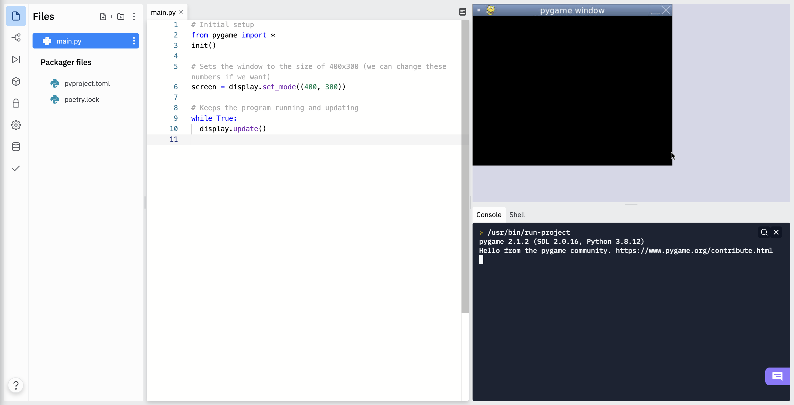
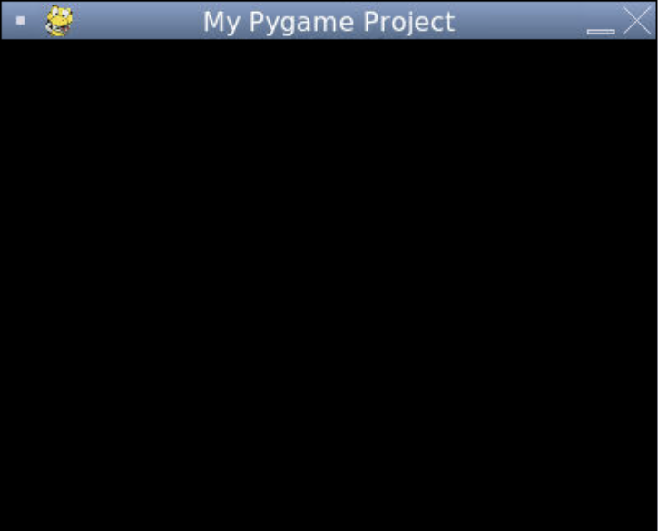

# [Link to video.](https://www.youtube.com/watch?v=ZQq2anSn05o&list=PLVD25niNi0BnkkXdVEuU66WgUHMI_Z0h5&index=1)

### Pygame

Pygame is a set of custom modules that allows us to display graphics in a window. It was created independently of the inventor of Python. It came out approximately 10 years after Python was first created.

### Pygame.org

The official website for Pygame is [pygame.org](http://www.pygame.org) and the documentation page is [pygame.org/docs](http://www.pygame.org/docs/).

On the documentation page, we can find information about the different constants, variables, and functions we can use.

### Pygame in Replit

When we are using Pygame in Replit, we need to select Pygame as the "language" of the repl. It's not actually a language, but on Replit we need to select it as the langauge instead of Python in order for it to work.


There are a few lines of code that we need to include in every Pygame program.

```python
# Initial setup
from pygame import *
init()

# Sets the window to the size of 400x300 (we can change these numbers if we want)
screen = display.set_mode((400, 300))

# Keeps the program running and updating
while True:
  display.update()
```

1. We first need to import the Pygame module and initialize it. 
2. We then need to create a screen to put the graphics on.
3. Lastly, we need to continuously update the display using an infinite loop. This will keep the program running indefinitely until we press the Stop button.

Here is the result of this program.



Since Pygame is not a part of the Python Standard Library, the first time you run the program it will take a minute or so to install the packager files needed to run Pygame.

By default, the title of the Pygame window in the title bar in Replit is "pygame window" We can change that using `display.set_caption()`

```python
# Initial setup
from pygame import *
init()
screen = display.set_mode((400, 300))

# Sets the title in the title bar
display.set_caption("My Pygame Project") 

# Keeps the program running and updating
while True:
  display.update()
```


