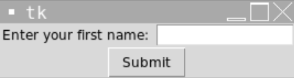
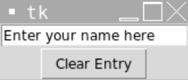

# [Link to video.](https://www.youtube.com/watch?v=1MnC3a1z3iM&list=PLVD25niNi0BlwZxjcVF6-vcOdAicWlRjC)

### Textboxes in Tkinter

We can use the `Entry` widget to get user input from a textbox. All of the properties we saw with `Label` also work with `Entry`.

```python
from tkinter import *
window = Tk()

# Creates a label for the textbox
label = Label(window, text = "Enter your first name: ")
label.grid(row = 0, column = 0)

# Creates a textbox with a width of 15 characters
entry = Entry(window, width = 15)
entry.grid(row = 0, column = 1)

mainloop()
```


To access the text inside an `Entry`, we use the `get()` method on it (not the `text` property).

```python
from tkinter import *
window = Tk()

# Creates a label for the textbox
label = Label(window, text = "Enter your first name: ")
label.grid(row = 0, column = 0)

# Creates a textbox with a width of 15 characters
entry = Entry(window, width = 15)
entry.grid(row = 0, column = 1)

# Creates a button for the textbox
button = Button(window, text = "Submit", command = lambda: print(f"Hello, {entry.get()}!"))
button.grid(row = 1, column = 0, columnspan = 2)

mainloop()
```



We can put text inside an `Entry` using the `insert()` method and delete the text using the `delete()` method. The `insert()` method takes a starting index and the string to insert and the `delete()` method takes a starting index and ending index. The built-in constant `END` can be used to access the last index in an `Entry`.

```python
from tkinter import *
window = Tk()

# Creates a textbox with text inside it already
entry = Entry(window, width = 20)
entry.grid(row = 0, column = 0)
entry.insert(0, "Enter your name here")

# Creates a button delete the text inside the textbox
button = Button(window, text = "Clear Entry", command = lambda: entry.delete(0, END))
button.grid(row = 1, column = 0)

mainloop()
```


