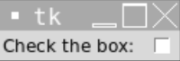
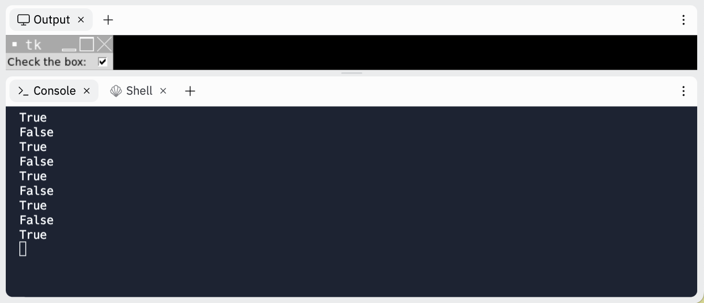

# [Link to video.](https://www.youtube.com/watch?v=K2dkRWVLtb8&list=PLVD25niNi0BlwZxjcVF6-vcOdAicWlRjC)

### Checkboxes in Tkinter

We can use the `Checkbutton` widget to create checkboxes.

```python
from tkinter import *
window = Tk()

# Creates a label for the checkbox
label = Label(window, text = "Check the box: ")
label.grid(row = 0, column = 0)

# Creates a checkbox
checkbox = Checkbutton(window)
checkbox.grid(row = 0, column = 1)

mainloop()
```



To see whether the box is checked or unchecked, we need a separate variable to hold its value. Depending on what type of value we want to use, we can choose `IntVar()`, `BooleanVar()`, or `StringVar()`.

```python
from tkinter import *
window = Tk()

# Creates a label for the checkbox
label = Label(window, text = "Check the box: ")
label.grid(row = 0, column = 0)

# Creates a variable to keep track of the checkbox's value
checkbox_status = BooleanVar()

# Creates a checkbox that prints True when it gets checked and False when it gets unchecked
checkbox = Checkbutton(window, variable = checkbox_status, command = lambda: print(checkbox_status.get()))
checkbox.grid(row = 0, column = 1)

mainloop()
```



The default values are `IntVar()` are `0` and `1`, the default values for `BooleanVar()` are `True` and `False`, and the default values for `StringVar()` are `"0"` and `"1"`. If we want custom values, we can modify the `onvalue` and `offvalue` properties.
```python
from tkinter import *
window = Tk()

# Creates a label for the checkbox
label = Label(window, text = "Check the box: ")
label.grid(row = 0, column = 0)

# Creates a variable to keep track of the checkbox's value
checkbox_status = StringVar()

# Creates a checkbox that prints True when it gets checked and False when it gets unchecked
checkbox = Checkbutton(window, variable = checkbox_status, command = lambda: print(checkbox_status.get()), onvalue = "checked", offvalue = "unchecked")
checkbox.grid(row = 0, column = 1)

mainloop()
```


