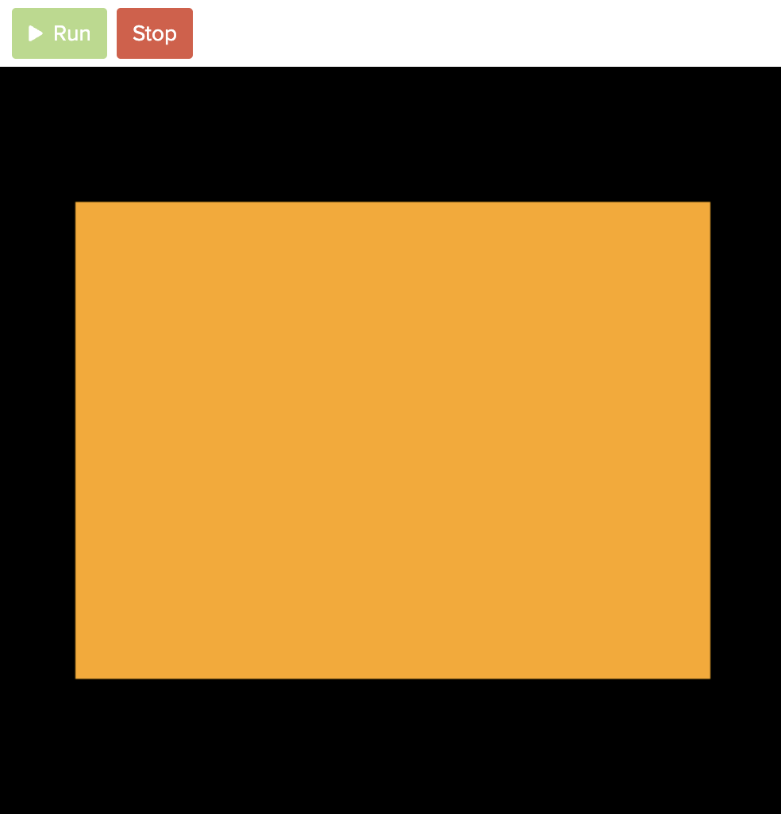
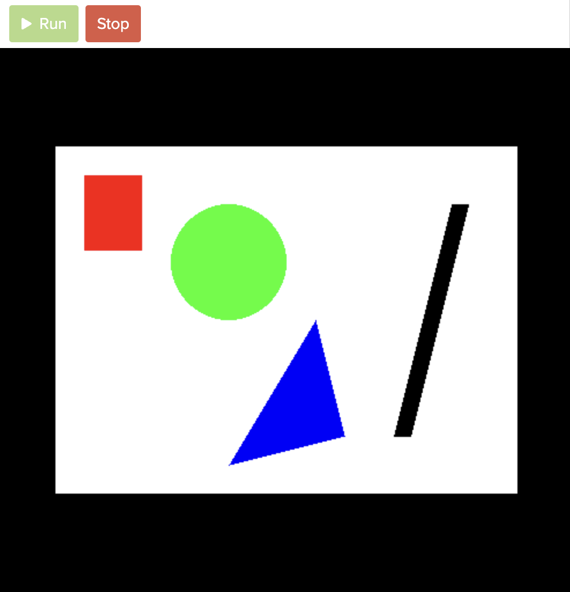

# [Link to video.](https://www.youtube.com/watch?v=Lts56_hkEb0&list=PLVD25niNi0BnsKwMvXId8jFMXxC1wUbko)

### Colours in Pygame

Most functions in Pygame that take a colour as a parameter can take the colour expressed as a tuple. For convenience, we can make constants for the colours we use in our program.

```python
# initializing colours (using RGB values) so we can use them later
WHITE = (255, 255, 255)
BLACK = (0, 0, 0)
RED = (255, 0, 0)
GREEN = (0, 255, 0)
BLUE = (0, 0, 255)
```

The default colour of a screen in Pygame is black. We can change the colour of the screen using `screen.fill()` like this:

```python
# initial setup
import pygame as pg
pg.init()
screen = pg.display.set_mode((400, 300))

# creates a constant for the colour orange and makes the background this colour
ORANGE = (255, 165, 0)
screen.fill(ORANGE) # makes the background orange

# keeps the program running and updating
while True:
    pg.display.update()
```



Pygame also recognizes [all these colour names](https://www.webucator.com/article/python-color-constants-module/). To use any of them, we just write the name as a string.

```python
# initial setup
import pygame as pg
pg.init()
screen = pg.display.set_mode((400, 300))

# makes the background white
screen.fill("orange") # 'orange' is a recognized colour name

# keeps the program running and updating
while True:
    pg.display.update()
```


### Shapes in Pygame

We can draw various shapes in various colours in Pygame. We can look at the [documentation for pygame.draw](https://www.pygame.org/docs/ref/draw.html) to learn about the functions that draw shapes. 

Here are a few examples of drawing shapes.

```python
# initial setup
import pygame as pg
pg.init()
screen = pg.display.set_mode((400, 300))

# initializing colours (using RGB values) so we can use them later
WHITE = (255, 255, 255)
GREEN = (0, 255, 0)
RED = (255, 0, 0)
BLUE = (0, 0, 255)
BLACK = (0, 0, 0)

screen.fill(WHITE)

# draws a green circle
'''The parameters of draw.circle() are:
- screen
- colour
- location of the center of the circle
- radius of the circle
'''
pg.draw.circle(screen, GREEN, (150, 100), 50)

# draws a red rectangle
'''The parameters of draw.rect() are:
- screen
- colour
- a tuple with:
  - the location of the top-left corner of the rectangle
  - the dimensions of the rectangle
'''
pg.draw.rect(screen, RED, ((25, 25), (50, 65)))

# draws a blue triangle
'''The parameters of draw.polygon() are:
- screen
- colour
- location of the vertices
'''
pg.draw.polygon(screen, BLUE, ((250, 250), (225, 150), (150, 275)))

# draws a white line
'''The parameters of draw.line() are:
- screen
- colour
- location of the start point
- location of the end point
- width
'''
pg.draw.line(screen, BLACK, (350, 50), (300, 250), 15)

while True:
    pg.display.update()
```

The shapes above look like this:


