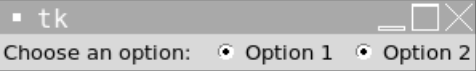
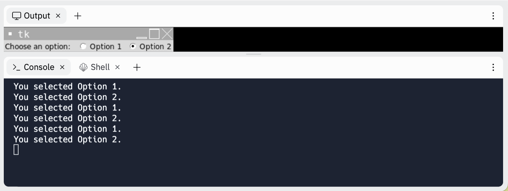

# [Link to video.](https://www.youtube.com/watch?v=qDasZue55bQ&list=PLVD25niNi0BlwZxjcVF6-vcOdAicWlRjC)

### Radio Buttons in Tkinter

A **radio button** is a group of boxes in which only one box is supposed be checked off a time. We can use the `Radiobutton` widget to create radio buttons. 

```python
from tkinter import *
window = Tk()

# Creates a label for the checkbox
label = Label(window, text = "Choose an option: ")
label.grid(row = 0, column = 0)

# Creates two radio buttons
radio_button1 = Radiobutton(window, text = "Option 1")
radio_button1.grid(row = 0, column = 1)
radio_button2 = Radiobutton(window, text = "Option 2")
radio_button2.grid(row = 0, column = 2)

mainloop()
```



To group radio buttons together, we need to create a common variable for them. Just like with `Checkbutton`, we can choose between `IntVar()`, `BooleanVar()`, or `StringVar()`. We can use the `value` property to assign different values to each radio button.

```python
from tkinter import *
window = Tk()

# Creates a label for the checkbox
label = Label(window, text = "Choose an option: ")
label.grid(row = 0, column = 0)

# Creates a variable to keep track of which radio button is selected
radio_button_status = IntVar()

def print_option_number():
  print(f"You selected Option {radio_button_status.get()}." )

# Creates two radio buttons grouped together that print a message when clicked 
radio_button1 = Radiobutton(window, text = "Option 1", command = print_option_number, variable = radio_button_status, value = 1)
radio_button1.grid(row = 0, column = 1)
radio_button1.select() # selects Option 1 by default
radio_button2 = Radiobutton(window, text = "Option 2", command = print_option_number, variable = radio_button_status, value = 2)
radio_button2.grid(row = 0, column = 2)

mainloop()
```


