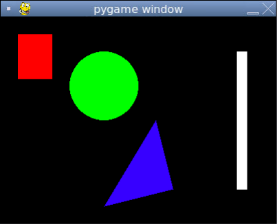

# [Link to video.](https://www.youtube.com/watch?v=GreW46_42EA&list=PLVD25niNi0BnkkXdVEuU66WgUHMI_Z0h5&index=2)

### Colours in Pygame

Most functions in Pygame that take a colour as a parameter can take the colour expressed as a tuple. For convenience, we can make constants for the colours we use in our program.

```python
# Initializing colours (using RGB values) so we can use them later
WHITE = (255, 255, 255)
BLACK = (0, 0, 0)
RED = (255, 0, 0)
GREEN = (0, 255, 0)
BLUE = (0, 0, 255)
```

The default colour of a screen in Pygame is black. We can change the colour of the screen using `screen.fill()` like this:

```python
# Initial setup
from pygame import *
init()
screen = display.set_mode((400, 300))

# Creates a constant for the colour white and makes the background this colour
WHITE = (255, 255, 255)
screen.fill(WHITE) # makes the background white

# Keeps the program running and updating
while True:
  display.update()
```


Pygame also recognizes [all these colour names](https://www.webucator.com/article/python-color-constants-module/). To use any of them, we just write the name as a string.

```python
# Initial setup
from pygame import *
init()
screen = display.set_mode((400, 300))

# Makes the background white
screen.fill("white) # 'white' is a recognized colour name

# Keeps the program running and updating
while True:
  display.update()
```


### Shapes in Pygame

We can draw various shapes in various colours in Pygame. We can look at the [documentation for pygame.draw](https://www.pygame.org/docs/ref/draw.html) to learn about the functions that draw shapes. 

Here are a few examples of drawing shapes.

```python
from pygame import *
init()
screen = display.set_mode((400, 300))

# Initializing colours (using RGB values) so we can use them later
GREEN = (0, 255, 0)
RED = (255, 0, 0)
BLUE = (0, 0, 255)
WHITE = (255, 255, 255)

# Draws a green circle
'''The parameters of draw.circle() are:
- screen
- colour
- location of the center of the circle
- radius of the circle
'''
draw.circle(screen, GREEN, (150, 100), 50)

# Draws a red rectangle
'''The parameters of draw.rect() are:
- screen
- colour
- a tuple with:
  - the location of the top-left corner of the rectangle
  - the dimensions of the rectangle
'''
draw.rect(screen, RED, ((25, 25), (50, 65)))

# Draws a blue triangle
'''The parameters of draw.polygon() are:
- screen
- colour
- location of the vertices
'''
draw.polygon(screen, BLUE, ((250, 250), (225, 150), (150, 275)))

# Draws a white line
'''The parameters of draw.line() are:
- screen
- colour
- location of the start point
- location of the end point
- width
'''
draw.line(screen, WHITE, (350, 50), (350, 250), 15)

while True:
  display.update()
```

The shapes above look like this:



