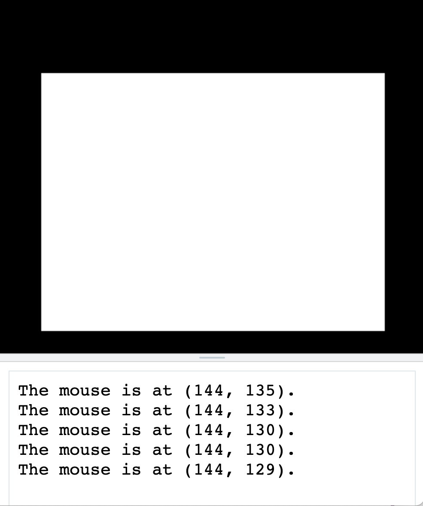
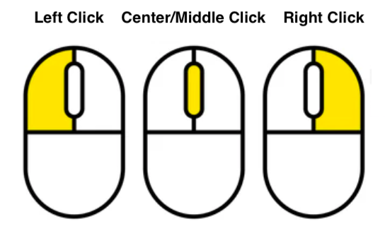
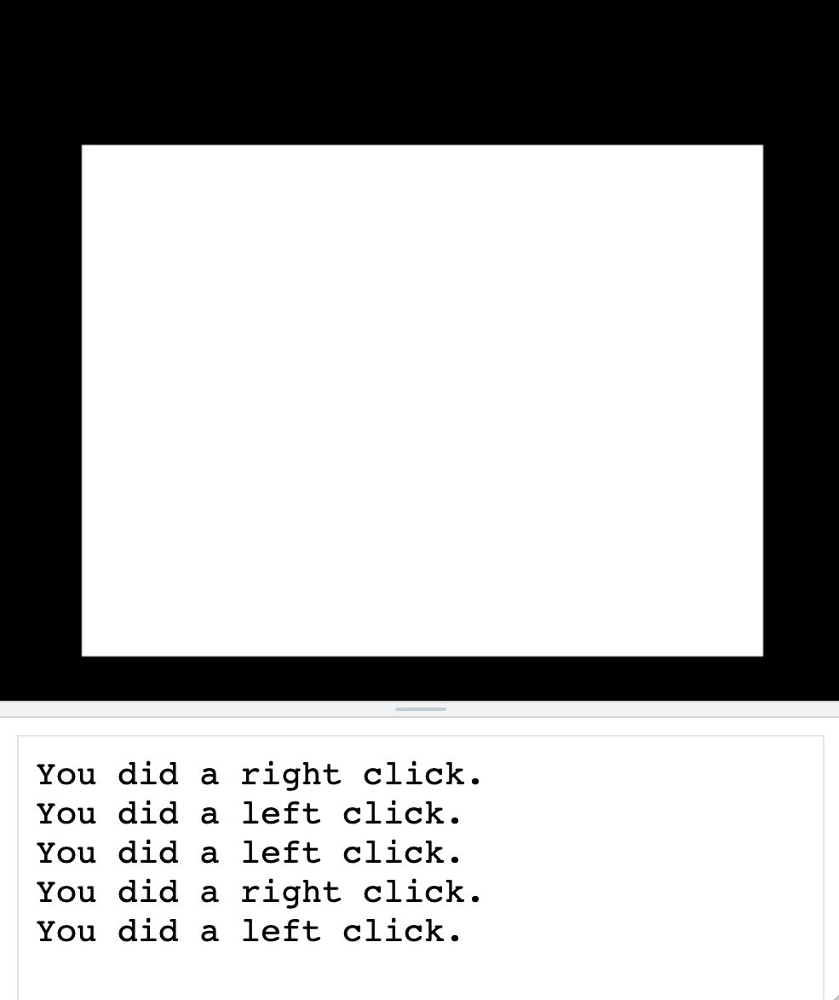

# [Link to video.](https://www.youtube.com/watch?v=Oh92ff1oQ4w&list=PLVD25niNi0BnsKwMvXId8jFMXxC1wUbko)

### Mouse Interactions in Pygame

In Pygame, we can create programs that involve mouse interactions. We can control what happens on the screen with our mouse.

To do this, we check through the list `event.get()` within the infinite while loop. This list contains **events**, which include information about where the mouse cursor is and which mouse buttons have just been pressed.

These are the names of the event types we'll be using for mouse events. They are written in all capital letters since they are constants.

* `MOUSEMOTION`
* `MOUSEBUTTONUP`
* `MOUSEBUTTONDOWN`

### Mouse Movement

Here is how we can store and use the location of the mouse cursor on the screen:

```python
# Pygame needs to be imported
import pygame as pg

# Initial setup
pg.init()
screen = pg.display.set_mode((400, 300))
screen.fill("white")

# Keeps the program running
while True:
    for event in pg.event.get():
        # Checks for mouse motion
        if event.type == pg.MOUSEMOTION:
            # Gets the coordinates of the mouse
            mouse_x = pg.mouse.get_pos()[0]
            mouse_y = pg.mouse.get_pos()[1]
            print(f"The mouse is at ({mouse_x}, {mouse_y}).")  # prints the mouse coordinates to the screen when the mouse moves
    pg.display.update()
```



### Mouse Clicking

A mouse typically has three buttons.

If we use a trackpad instead, a left click is the same as a one-finger click and a right click is the same as a two-finger click.



Here is how we can check whether the mouse has been left-clicked or right-clicked.

```python
# Pygame needs to be imported
import pygame as pg

# Initial setup
pg.init()
screen = pg.display.set_mode((400, 300))
screen.fill("white")

# Keeps the program running
while True:
    for event in pg.event.get():
        # Checks for mouse clicking
        if event.type == pg.MOUSEBUTTONDOWN:
            # Checks whether the left or right mouse buttons were clicked
            left_clicked = pg.mouse.get_pressed()[0]
            right_clicked = pg.mouse.get_pressed()[2]
            if left_clicked:
                print("You did a left click.")
            if right_clicked:
                print("You did a right click.")
    pg.display.update()
```


