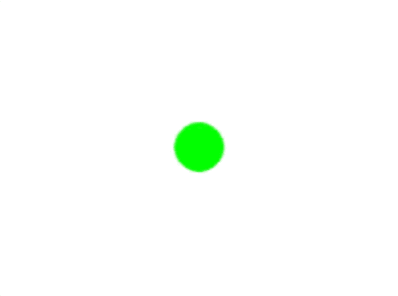

# [Link to video.](https://www.youtube.com/watch?v=BMUfZnzkc-c&list=PLVD25niNi0BnsKwMvXId8jFMXxC1wUbko)

### Keyboard Interaction in Pygame

In Pygame, we can create programs that involve keyboard interactions. We can control what happens on the screen with our keyboard. 

To do this, we check through the list `event.get()` within the infinite while loop. This list includes events that tell us which keys on the keyboard have just been pressed.

These are the names of the event types we'll be using for keyboard interaction. They are written in all capital letters since they are constants.

* `KEYDOWN`
* `KEYUP`

### Keyboard Controls

```python
# Pygame needs to be imported
import pygame as pg

# initial setup
pg.init()
WIDTH = 400
HEIGHT = 300
screen = pg.display.set_mode((WIDTH, HEIGHT))

# keeps track of a position of the circle on the screen
position = [WIDTH/2, HEIGHT/2]

# keeps the program running
while True:
    # repaints the background to cover up previous circles
    screen.fill("white")
    # draws a circle at the new location
    pg.draw.circle(screen, "green", position, 25)
    for event in pg.event.get():
        # checks for keys that have been pressed
        if event.type == pg.KEYDOWN:
            if event.key == pg.K_LEFT:
                # moves the position 10 pixels left
                position[0] -= 10
            if event.key == pg.K_RIGHT:
                # moves the position 10 pixels right
                position[0] += 10
            if event.key == pg.K_UP:
                # moves the position 10 pixels up
                position[1] -= 10
            if event.key == pg.K_DOWN:
                # moves the position 10 pixels down
                position[1] += 10   
    pg.display.update()
```



We can get the entire list of the names of keys here: https://www.pygame.org/docs/ref/key.html.
