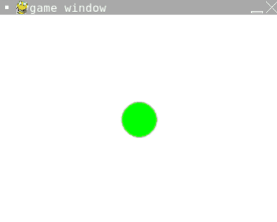

# [Link to video.](https://www.youtube.com/watch?v=hUJuj1iuvKI&list=PLVD25niNi0BlwZxjcVF6-vcOdAicWlRjC)

### Keyboard Interaction in Pygame

Suppose we want something to happen as we are continuously holding down a key. In this case, we can use the tuple `key.get_pressed()` which tells us which keys are currently being held down. Each item in `key.get_pressed()` represents a key and is a `0` (`False`) or `1` (`True`) value. `key.get_pressed()` only works if `event.get()` is called.

```python
# Pygame needs to be imported
import pygame as pg

# Initial setup
pg.init()
WIDTH = 400
HEIGHT = 300
screen = pg.display.set_mode((WIDTH, HEIGHT))

# Keeps track of a position of the circle on the screen
position = [WIDTH/2, HEIGHT/2]

# Keeps the program running
while True:
  # Repaints the background to cover up previous circles
  screen.fill("white")
  # Draws a circle at the new location
  pg.draw.circle(screen, "green", position, 25)
  pg.event.get() # This line is needed for keys.get_pressed() to work
  pressed_keys = pg.key.get_pressed()
  if pressed_keys[pg.K_LEFT]:
    # Moves the position 1 pixel left
    position[0] -= 1
  if pressed_keys[pg.K_RIGHT]:
    # Moves the position 1 pixel right
    position[0] += 1
  if pressed_keys[pg.K_UP]:
    # Moves the position 1 pixel up
    position[1] -= 1
  if pressed_keys[pg.K_DOWN]:
    # Moves the position 1 pixel down
    position[1] += 1
  pg.display.update()
```



If we want to change the frame rate, we can put `pg.time.Clock().tick(20)` (replace 20 with the new frame rate) in the loop. By default, the frame rate is 60 frames per second, meaning the maximum number of times `pg.display.update()` is called per second is 60 times.
