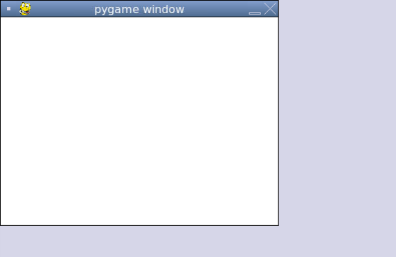

### RGB Values

All colours that can be displayed on a computer can be expressed using 24 bits. The most common ways to express them are using a red-green-blue (**RGB**) value. An RGB value shows how to create the colour using combinations of red, green, and blue. It is often represented as a tuple in which each number is an 8-bit integer ranging from 0 to 255.

Here are the RGB values of common colours.

| Colour | RGB value       |
| ------ | --------------- |
| Black  | (0, 0, 0)       |
| White  | (255, 255, 255) |
| Red    | (255, 0, 0)     |
| Orange | (128, 127, 0)   |
| Yellow | (255, 255, 0)   |
| Green  | (0, 255, 0)     |
| Blue   | (0, 0, 255)     |
| Purple | (128, 0, 128)   |
| Pink   | (255, 192, 203) |

### Colours in Pygame

Most functions in Pygame that take a colour as a parameter need the colour to be expressed as a tuple. For convenience, we can make constants for the colours we use in our program.

```python
# Initializing colours (using RGB values) so we can use them later
white = (255, 255, 255)
black = (0, 0, 0)
red = (255, 0, 0)
green = (0, 255, 0)
blue = (0, 0, 255)
```

The default colour of a screen in Pygame is black. We can change the colour of the screen using `screen.fill()` like this:

```python
from pygame import *

init()

screen = display.set_mode((400, 300))

white = (255, 255, 255)

screen.fill(white) # makes the background white

while True:
  display.update()
```

