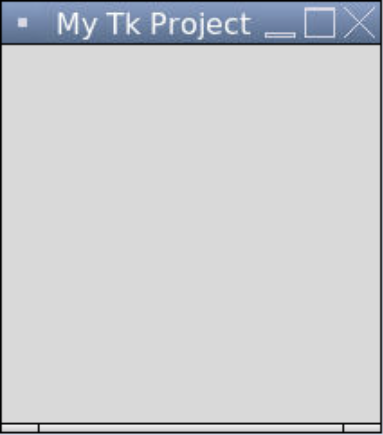

### Tkinter

Tkinter (pronounced "tee-kinter" or "tuh-kinter" or "tee-kay-inter", short for *Tk interface*) is a package in the Python Standard Library. Tikinter is the de facto package used to create GUIs (graphic user interfaces) in Python. A GUI (pronounced "gooey") is a way of interacting with a computer. Examples of GUIs include windows, icons, and menus.

There are a few lines of code that we need to include in every Tkinter program.

```python
# Importing Tkinter
from tkinter import *

# Creates the window
Tk()

# Keeps the program running and updating
mainloop()
```

1. We first need to import the `tkinter` package.
2. We then need to create a window to put the graphics on.
3. Lastly, we need to keep the program running so that the window keeps displaying, which is what `mainloop()` does. This will keep the program running indefinitely until we hit the Stop button.

Here is the result of this program.


By default, the title of the window in the title bar in Replit is "tk" We can change that using `title()` method on the window.

```python
# Importing Tkinter
from tkinter import *

# Creates the window
window = Tk()

# Sets the title in the title bar
window.title("My Tk Project")

# Keeps the program running and updating
mainloop()
```


