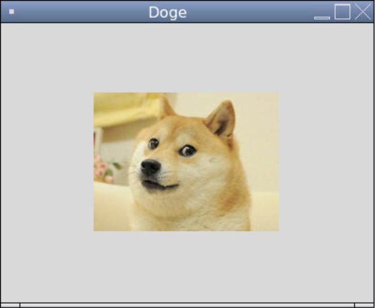

### Images in Tkinter

We can place images on a canvas using `create_image()`. The parameters are `(x, y, **kwargs)` where the center of the image is at (x, y). The keyword argument for the image is `image`, which takes a `PhotoImage` object. The `PhotoImage()` constructor takes keyword arguments including `file` for the filepath of the image. 

```python
from tkinter import *

# Creates the window and sets the title
window = Tk()
window.title("Doge")

# Sets the size of the canvas
WIDTH = 400
HEIGHT = 300

# Creates the canvas for the image to go on
canvas = Canvas(window, width = WIDTH, height = HEIGHT)
canvas.pack()

# Loads the meme image
doge = PhotoImage(file = "doge.png")

# Puts the image onto the screen
canvas.create_image(WIDTH/2, HEIGHT/2, image = doge)

# Keeps the program running and updating
mainloop()
```


To make a `PhotoImage` smaller, we can use the `subsample()` method, which takes a positive integer indicating the scalar factor. Unfortunately there is no way to shrink an `PhotoImage` to specific dimensions other than dividing the width and height by a positive integer. We might have to use separate image editing software to change the dimensions more precisely.

```python
from tkinter import *

# Creates the window and sets the title
window = Tk()
window.title("Doge")

# Sets the size of the canvas
WIDTH = 400
HEIGHT = 300

# Creates the canvas for the image to go on
canvas = Canvas(window, width = WIDTH, height = HEIGHT)
canvas.pack()

# Loads the meme image
doge = PhotoImage(file = "doge.png")

# Halfs the image's width and height
doge = doge.subsample(2)

# Puts the image onto the screen
canvas.create_image(WIDTH/2, HEIGHT/2, image = doge)

# Keeps the program running and updating
mainloop()
```



Unfortunately, `PhotoImage` only supports for these image file types: GIF, PGM, PPM, and PNG. If we want to use another image file type, such as JPG, we need a different library. One of the most common image libraries is called `PIL`, short for *Python Imaging Library*.

```python
from tkinter import *
from PIL import Image, ImageTk

# Creates the window and sets the title
window = Tk()
window.title("Doge")

# Sets the size of the canvas
WIDTH = 400
HEIGHT = 300

# Creates the canvas for the image to go on
canvas = Canvas(window, width = WIDTH, height = HEIGHT)
canvas.pack()

# Loads the meme image as a PhotoImage object
doge = ImageTk.PhotoImage(Image.open("doge.jpg"))

# Puts the image onto the screen
canvas.create_image(WIDTH/2, HEIGHT/2, image = doge)

# Keeps the program running and updating
mainloop()
```


With `PIL`, we can also freely modify the dimensions of an image. We first create an `Image` object, then we use the `resize()` method, then we create a `PhotoImage` object.

```python
from tkinter import *
from PIL import Image, ImageTk

# Creates the window and sets the title
window = Tk()
window.title("Doge")

# Sets the size of the canvas
WIDTH = 400
HEIGHT = 300

# Creates the canvas for the image to go on
canvas = Canvas(window, width = WIDTH, height = HEIGHT)
canvas.pack()

# Loads the meme image as an Image object, resizes it, and makes it a PhotoImage object
doge = Image.open("doge.jpg")
doge = doge.resize((200, 150))
doge = ImageTk.PhotoImage(doge)

# Puts the image onto the screen
canvas.create_image(WIDTH/2, HEIGHT/2, image = doge)

# Keeps the program running and updating
mainloop()
```


