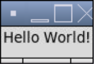
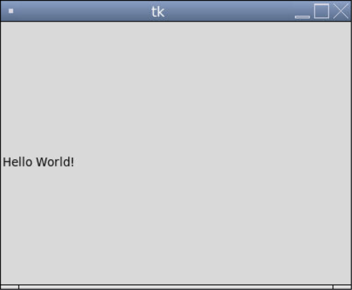
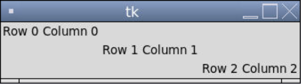
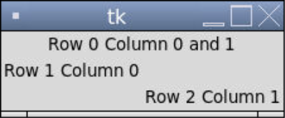

# [Link to video.](https://www.youtube.com/watch?v=fvu_2tPl0us&list=PLVD25niNi0BnqxVm1TDHLvdHOM3FDaV36&index=7)

### Widgets in Tkinter

So far we've been using a canvas to draw shapes, images, and text. This is not the only way to use Tkinter, so we'll be exploring other uses.

A **widget** is an individual element of a GUI. Tkinter widgets include: labels, buttons, text boxes, checkboxes, radio buttons, scales, dropdown menus, message boxes, and so on.  

Each of these widgets have their own class. The constructor takes the window and a variety of keyword arguments representing **properties** of the widget.

### The Packing System

Once we create a widget, we still have to place it onto the window. We can do so using the `pack()` method or `grid()` method. We have to pick one of them to use consistently in a program – we can't use `pack()` on some widgets and `grid()` on other widgets in the same program. 

When we use `pack()` with the default window size, the window will take up the minimum size needed to fit the widgets. 

```python
from tkinter import *

# Creates the window
window = Tk()

# Creates a label for some text to go on
label = Label(window, text = "Hello  World!")  # creates the label
label.pack()  # puts the label on the window and adjusts the size of the window accordingly

# Keeps the program running and updating
mainloop()
```



If we instead want the window to be a fixed size, we can use the `geometry()` method, which takes a string in the form `"widthxheight"`, such as `"400x300"`. When we do that, we can pick the coordinates of the widget using the `place()` method after we call `pack()`. Properties of the `place()` method include `x` for the x-coordinate and `y` for the y-coordinate.

```python
from tkinter import *

# The size of the window
WIDTH = 400
HEIGHT = 300

# Creates the window that's 400 pixels by 300 pixels
window = Tk()
window.geometry(f"{WIDTH}x{HEIGHT}")

# Creates a label for some text to go on
label = Label(window, text = "Hello World!")  # creates the label
label.pack()  # puts the label on the window
label.place(x = 0, y = HEIGHT/2) # moves the label to (0, 150)

# Keeps the program running and updating
mainloop()
```



### The Grid System

If we use `grid()` instead of `pack()`, the widgets are arranged in a grid system. Properties of the `grid()` method include `row` for the row number (starting at 0) and `column` for the column number (starting at 0). Blank rows and blank columns take up no space where as occupied cells take up the minimum amount of space needed.

```python
from tkinter import *
window = Tk()

# Creates labels for some text to go on
label00 = Label(window, text = "Row 0 Column 0")
label00.grid(row = 0, column = 0)
label11 = Label(window, text = "Row 1 Column 1") 
label11.grid(row = 1, column = 1)
label22 = Label(window, text = "Row 2 Column 2")
label22.grid(row = 2, column = 2)  

# Keeps the program running and updating
mainloop()
```



If we want to merge cells together, we can use the `columnspan` property to indicate how many horizontally-adjacent cells to merge together.

```python
from tkinter import *
window = Tk()

# Creates labels for some text to go on
label00 = Label(window, text = "Row 0 Column 0 and 1")
label00.grid(row = 0, column = 0, columnspan = 2)

label10 = Label(window, text = "Row 1 Column 0")
label10.grid(row = 1, column = 0)

label21 = Label(window, text = "Row 2 Column 1")
label21.grid(row = 2, column = 1)

# Keeps the program running and updating
mainloop()
```



### Accesing Widget Properties

If we want to access or change the property of a widget, the syntax is similar to access a value in a dictionary by its key.

```python
from tkinter import *
window = Tk()

label = Label(window, fill = "blue", text = "hi", background = "white")

# Playing with the 'text' property
print(label["text"]) # prints 'hi'
label["text"] = "hello" # changes the 'text' property to 'hello'
print(label["text"]) # prints 'hi'

# Keeps the program running and updating
mainloop()
```
