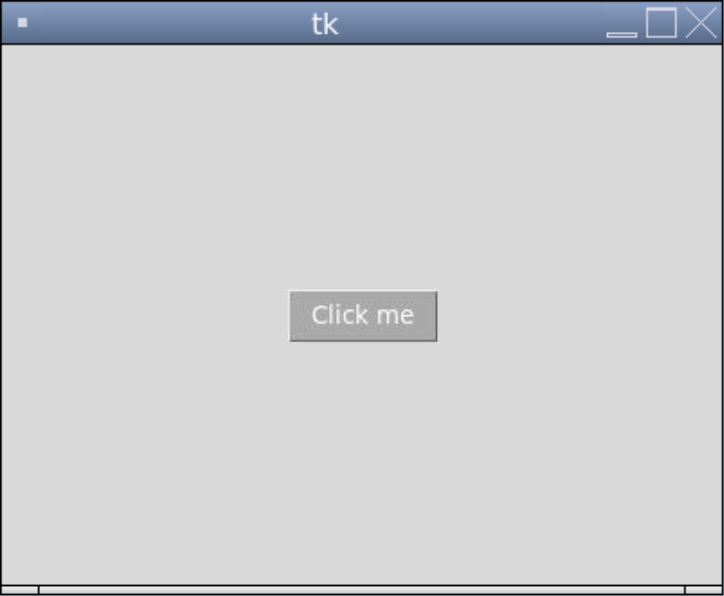
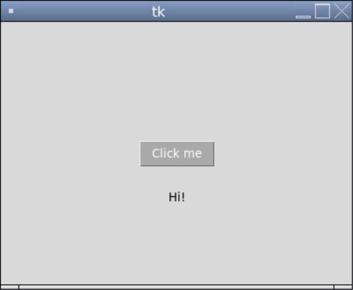
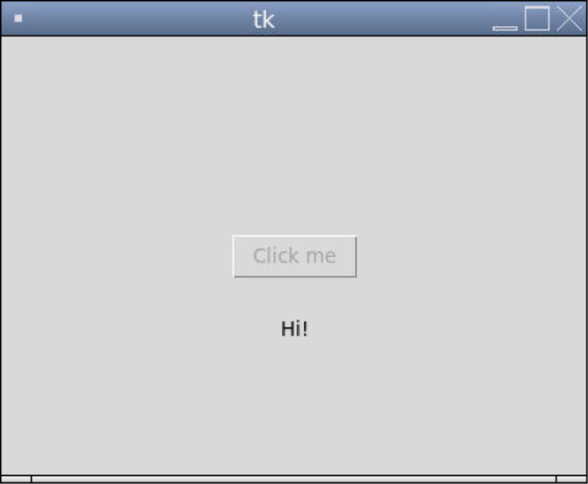

### Buttons in Tkinter

We can create buttons using the `Button` widget. The keyword arguments for the `Button()` constructor include `text`, `anchor`, `foreground`, `background`, `width`, `height`, and several other ones we've already seen.

```python
from tkinter import *

# The size of the window
WIDTH = 400
HEIGHT = 300

# Creates the window that's 400 pixels by 300 pixels
window = Tk()
window.geometry(f"{WIDTH}x{HEIGHT}")

# Creates a button with some text on it
button = Button(window, text = "Click me", foreground = "white", background = "dark grey")  # creates the label
button.pack()  # puts the button on the window
button.place(x = WIDTH/2, y = HEIGHT/2, anchor = "center") # moves the button to the middle of the window

# Keeps the program running and updating
mainloop()
```



To add functionality to the button, we use the keyword argument `command` with the name of the function as the value.

```python
from tkinter import *

# The size of the window
WIDTH = 400
HEIGHT = 300

# Creates the window that's 400 pixels by 300 pixels
window = Tk()
window.geometry(f"{WIDTH}x{HEIGHT}")

# The function that's called when the button is pressed
def print_hi():
  """Creates a label that says 'Hi!' under the button."""
  hi_label = Label(window, text = "Hi!")
  hi_label.pack()
  hi_label.place(x = WIDTH/2, y = HEIGHT/2 + 50, anchor = "center")

# Creates a button with some text on it
button = Button(window, text = "Click me", foreground = "white", background = "dark grey", command = print_hi)  # creates the label
button.pack()  # puts the button on the window
button.place(x = WIDTH/2, y = HEIGHT/2, anchor = "center") # moves the button to the middle of the window

# Keeps the program running and updating
mainloop()
```



We can disable a button by setting the `"state"` property to `"disabled"`. This greys out the text on it as a visual cue that it can't be pressed for now. 

```python
from tkinter import *

# The size of the window
WIDTH = 400
HEIGHT = 300

# Creates the window that's 400 pixels by 300 pixels
window = Tk()
window.geometry(f"{WIDTH}x{HEIGHT}")

# The function that's called when the button is pressed
def print_hi_and_disable():
  """Creates a label that says 'Hi!' under the button then disables the button."""
  hi_label = Label(window, text = "Hi!")
  hi_label.pack()
  hi_label.place(x = WIDTH/2, y = HEIGHT/2 + 50, anchor = "center")
  button["state"] = "disabled"

# Creates a button with some text on it
button = Button(window, text = "Click me", command = print_hi_and_disable)  # creates the label
button.pack()  # puts the button on the window
button.place(x = WIDTH/2, y = HEIGHT/2, anchor = "center") # moves the button to the middle of the window

# Keeps the program running and updating
mainloop()
```


