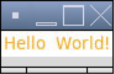
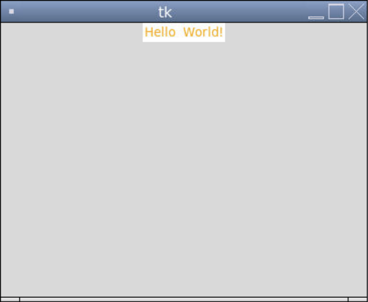
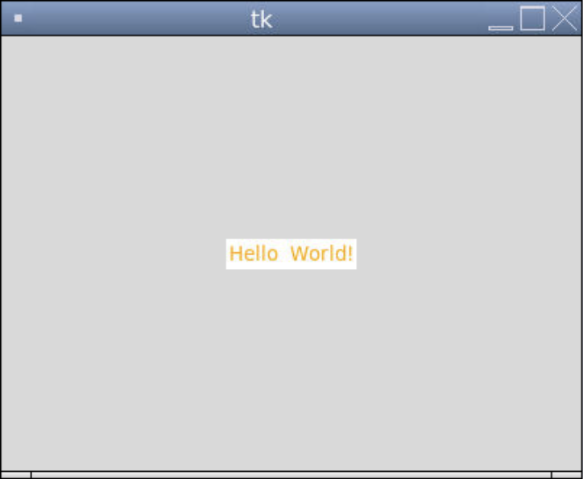

### Labels in Tkinter

So far we've ben using `Canvas.create_text()` to put text onto a window. A more common way of displaying text in Tkinter is using a `Label` widget. 

The keyword arguments for the `Label()` constructor include `text`, `image`, `anchor`, `foreground` (similar to `fill`), `background`, `width`, `height`, and several other ones we've already seen.

```python
from tkinter import *

# Creates the window
window = Tk()

# Creates a label for some text to go on
label = Label(window, text = "Hello  World!", foreground = "orange", background = "white")  # creates the label
label.pack()  # puts the label on the window and adjusts the size of the window accordingly

# Keeps the program running and updating
mainloop()
```



Whenever we use `pack()` to put a widget on a default-size window, the window fits the size of the widget. If we instead want the window to be a fixed size, we can use the `geometry` method, which takes a string in the form `"widthxheight"`, such as `"400x300"`.

```python
from tkinter import *

# The size of the window
WIDTH = 400
HEIGHT = 300

# Creates the window that's 400 pixels by 300 pixels
window = Tk()
window.geometry(f"{WIDTH}x{HEIGHT}")

# Creates a label for some text to go on
label = Label(window, text = "Hello  World!", foreground = "orange", background = "white")  # creates the label
label.pack()  # puts the label on the window and adjusts the size of the window accordingly

# Keeps the program running and updating
mainloop()
```



If we want to place the label is a specific location, we can use the `place()` method after we `pack()` it. The `place()` method takes keyword arguments including `x` (the x-coordinate), `y` (the y-coordinate), and `anchor`.

We can also change the text on the label at any point by changing the `"text"` property.
```python
from tkinter import *

# The size of the window
WIDTH = 400
HEIGHT = 300

# Creates the window that's 400 pixels by 300 pixels
window = Tk()
window.geometry(f"{WIDTH}x{HEIGHT}")

# Creates a label for some text to go on
label = Label(window, foreground = "orange", background = "white")  # creates the label
label.pack()  # puts the label on the window
label.place(x = WIDTH/2, y = HEIGHT/2, anchor = "center") # moves the label to the middle of the window
label["text"] = "Hello World!"  # sets the text of the label

# Keeps the program running and updating
mainloop()
```


