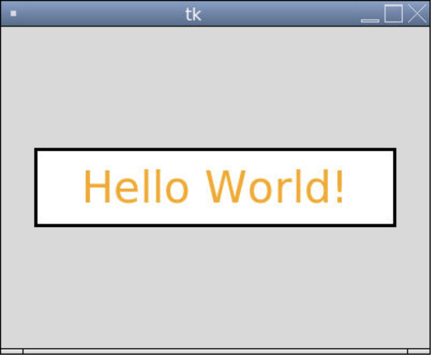
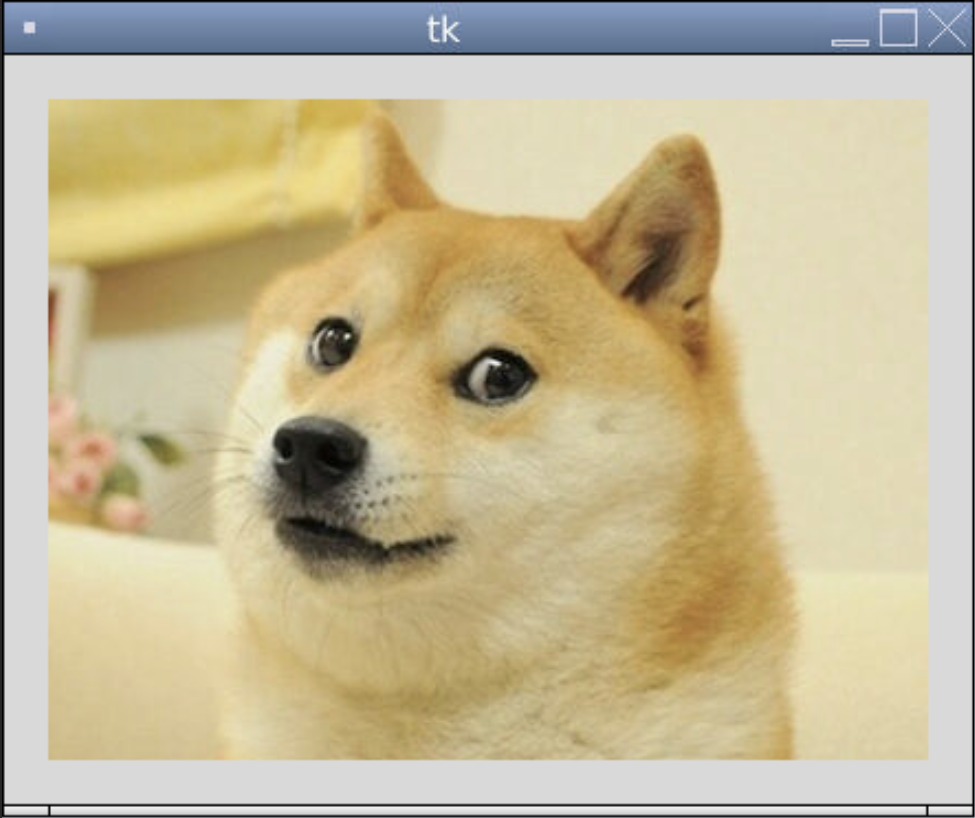

# [Link to video.](https://www.youtube.com/watch?v=gNkNi_zHPn8&list=PLVD25niNi0BnqxVm1TDHLvdHOM3FDaV36&index=8)

### Labels in Tkinter

So far we've ben using `Canvas.create_text()` to put text onto a window. A more common way of displaying text in Tkinter is using a `Label` widget. 

Here are some of the properties of `Label`:
* `text`
* `image` 
* `anchor`
* `background` (same as `bg`)
* `foreground` (same as `fg`, similar to `fill`)
* `padx` (the number of pixels to the left and right of the label before the border)
* `pady` (the number of pixels above and below the label before the border)
* `relief` (the type of border: `"solid"`, `"groove"`, `"ridge"`, etc.)
* `borderwidth`
* `width` (only when `text` is used, the number of *characters* per line)
* `height` (only when `text` is used, the number of lines)
* `justify` (only when `text` is used)
* `font` (only when `text` is used)


Here's an example of a label containing text with a lot of custom properties.

```python
from tkinter import *

# The size of the window
WIDTH = 400
HEIGHT = 300

# Creates the window that's 400 pixels by 300 pixels
window = Tk()
window.geometry(f"{WIDTH}x{HEIGHT}")

# Creates a label for some text to go on
label = Label(window, text = "Hello World!", foreground = "orange", background = "white", borderwidth = 3, relief = "solid", padx = 10, pady = 10, width = 12, font = ("DejaVu Sans", 30))  # creates the label
label.pack()  # puts the label on the window
label.place(x = WIDTH/2, y = HEIGHT/2, anchor = "center") # moves the label to the middle of the window

# Keeps the program running and updating
mainloop()
```



Here's an example of a label containing an image.

```python
from tkinter import *
window = Tk()

# Loads the image
doge = PhotoImage(file = "doge.png")

# Creates a label for an image to go on
label = Label(window, image = doge, borderwidth = 20)  # creates the label
label.pack()  # puts the label on the window

# Keeps the program running and updating
mainloop()
```


