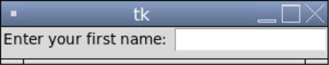
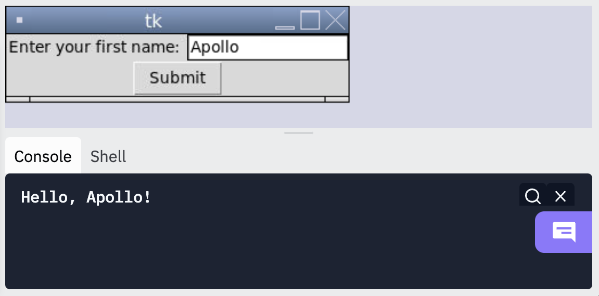

### Input Boxes in Tkinter

We can use the `Entry` widget to get user input from a textbox. All of the properties we saw with `Button` also work with Entry, except `text`.

```tkinter
from tkinter import *
window = Tk()


label = Label(window, text = "Enter your first name: ")
label.grid(row = 0, column = 0)

entry = Entry(window, width = 15)
entry.grid(row = 0, column = 1)

mainloop()
```



To access the text inside an `Entry`, we use the `get()` method on it (not the `text` property).

```tkinter
from tkinter import *
window = Tk()

label = Label(window, text = "Enter your first name: ")
label.grid(row = 0, column = 0)

entry = Entry(window, width = 15, text = "hi")
entry.grid(row = 0, column = 1)

button = Button(window, text = "Submit", command = lambda: print(f"Hello, {entry.get()}!"))
button.grid(row = 1, column = 0, columnspan = 2)

mainloop()
```



