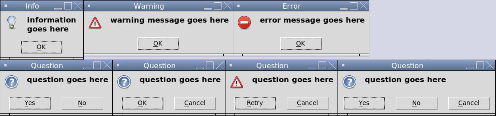
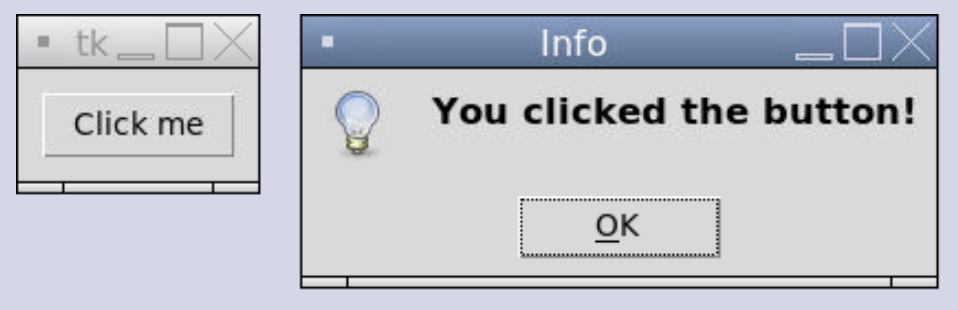

### Message Boxes in Tkinter

A **message box** is a window that pops up to display information. Tkinter has three categories of message boxes: information, warning, and question.

Here's what they look like: 



To display a message box, we need to import the `messagebox` module from `Tkinter` and call the function corresponding to the specific type of messagebox we want to use. The options are `showinfo()`, `showwarning()`, `showerror`, `askyesno`, `askokcancel`, `askretrycancel`, and `askyesnocancel()`. These functions take two strings: the title of the window bar and the message to display.

```tkinter
from tkinter import *
from tkinter import messagebox

# Creates the window
window = Tk()

def show_message():
  message.showinfo("Info", "You clicked the button!")

button = Button(window, text = "Click me", command = show_message)
button.pack(padx = 10, pady = 10)
```



Whenver we import a module from inside a package, we can use the wildcard (`*`) notation using the syntax `from package.module import *`.

```tkinter
from tkinter import *
from tkinter.messagebox import * // this line changed

# Creates the window
window = Tk()

def show_message():
  showinfo("Info", "You clicked the button!") // this line changed

button = Button(window, text = "Click me", command = show_message)
button.pack(padx = 10, pady = 10)
```
