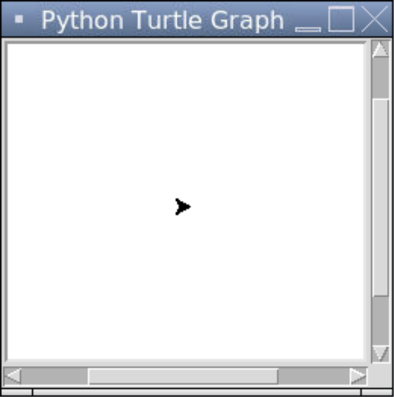

### Turtle

Turtle is a package in the Python Standard Library. It is a graphics library used to create animated drawings. The basic premise behind Turtle is that there is a turtle 🐢 moving around the screen and leaving a trail wherever they go.

There are a few lines of code that we need to include in every Turtle program.

```python
# Importing the turtle module
from turtle import *

# Creates a Turtle object and displays a window for it to go on
Turtle()

# Keeps the program running after the drawing is complete
done()
```

1. We first need to import the `turtle` package.
2. We then need to create a `Turtle` object. This will also create a window if there isn't one made already.
3. Lastly, we need to keep the program running so that the window keeps displaying, which is what `done()` does. This will keep the program running indefinitely until we hit the Stop button.

Here is the result of this program.



By default, the windows is quite small and the title of the window in the title bar in Replit is "Python Turtle Graphics". We can change the dimensions of the window using `setup()` and the title using `title()`.

```python
# Importing the turtle module
from turtle import *

# Creates a window with the size 400 by 300 and sets the title
setup(400, 300)
title("My Turtle Animation")

# Creates a turtle object 
Turtle()

# Keeps the program running after the drawing is complete
done()
```


Sometimes we see horizontal and vertical scrollbars. This is because our window size isn't strictly less than the default canvas size. We can remove the scrollers by redefining the default canvas width and height in a dictionary called `_CFG` (short for *configuration*) to be really small. 

```python
# Importing the turtle module
from turtle import *
from turtle import _CFG  # this dictionary to be imported separately

# Resizes the default canvas size to prevent scrollers
_CFG["canvwidth"] = 1 
_CFG["canvheight"] = 1

# Creates a window with the size 400 by 300 and sets the title
setup(400, 300)
title("My Turtle Animation")

# Creates a turtle object 
Turtle()

# Keeps the program running after the drawing is complete
done()
```


Our `Turtle` object is represented by an arrow by default. We can change that using the `shape()` function. The options are: `"arrow"`, `"turtle"`, `"circle"`, `"square"`, `"triangle"`, `"classic"`. We can also change its size using `turtlesize()` which takes three parameters: the width, height, and border thickness in pixels.

```python
# Importing the turtle module
from turtle import *
from turtle import _CFG  # we need this to remove the scrollers

# Resizes the default canvas size to prevent scrollers
_CFG["canvwidth"] = 1 
_CFG["canvheight"] = 1

# Creates a window with the size 400 by 300 and sets the title
setup(400, 300)
title("My Turtle Animation")

# Creates a Turtle object 
Turtle()

# Changes the Turtle's representation to be a turtle and makes it bigger
shape("turtle")
turtlesize(5, 5, 12)

# Keeps the program running after the drawing is complete
done()
```


### Official Documentation

Here is the official documentation for Turtle: https://docs.python.org/3/library/turtle.html.
