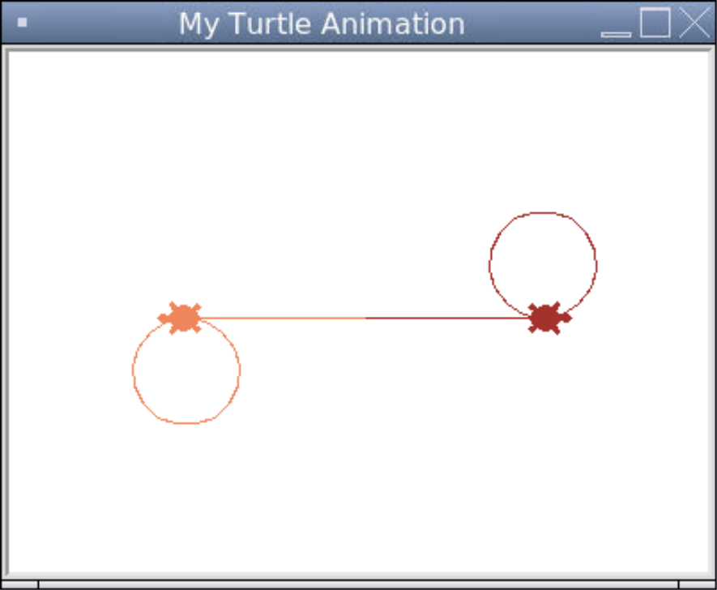

### Multiple Turtles

So far all of our Turtle progame have had just one turtle. When we first call a method that belongs to the `Turtle` class, this creates a `Turtle` object that becomes the default turtle in our program.

If we want to make more than one turtle, we can use the `Turtle()` constructor to create each one and treat all the functions we've seen so far as `Turtle` methods.

```python
# Importing the turtle module
from turtle import *
from turtle import _CFG  # we need this to remove the scrollers

# Resizes the default canvas size to prevent scrollers
_CFG["canvwidth"] = 1 
_CFG["canvheight"] = 1

# Creates a window with the size 400 by 300 and sets the title
setup(400, 300)
title("My Turtle Animation")

# Nancy the Turtle
nancy = Turtle()
nancy.shape("turtle")
nancy.speed(6)
nancy.color("firebrick")
nancy.forward(100)
nancy.circle(30)

# Arthur the Turtle
arthur = Turtle()
arthur.shape("turtle")
arthur.speed(3)
arthur.color("coral")
arthur.setheading(180)
arthur.forward(100)
arthur.circle(30)

# Keeps the program running after the drawing is complete
done()
```



We can only have one turtle moving at a time, so in the example above, Nancy goes first then Arthur goes afterwards.
