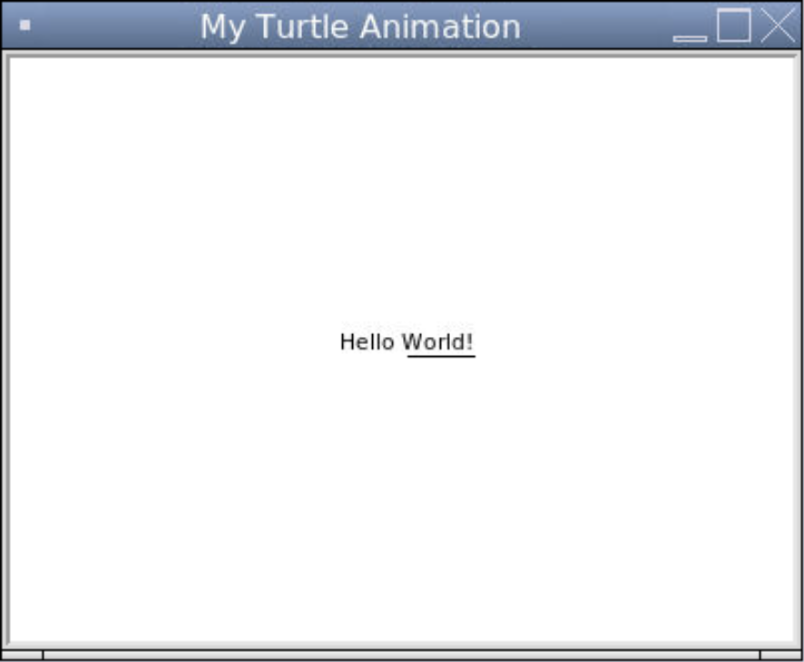
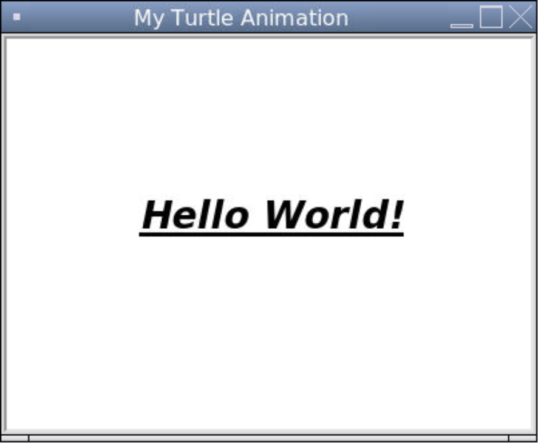

### Text in Turtle

We can place text on our window using `write()`. It takes a string representing the text to display. The text appears all at once instead of letter by letter.

```python
# Importing the turtle module
from turtle import *
from turtle import _CFG  # we need this to remove the scrollers

# Resizes the default canvas size to prevent scrollers
_CFG["canvwidth"] = 1 
_CFG["canvheight"] = 1

# Creates a window with the size 400 by 300 and sets the title
setup(400, 300)
title("My Turtle Animation")

# The turtle puts text onto the window
write("Hello World!")

# Hides the turtle after they are done drawing
hideturtle()

# Keeps the program running after the drawing is complete
done()
```


The `write()` function also takes the following keyword arguments:

* `align` for the alignment with respect to the turtle's coordinate (`"center"`, `"left"`, or `"align"`)
* `move` to indicate whether the turtle moves to the end of the text
* `font` as a tuple (see the section below)

```python
# Importing the turtle module
from turtle import *
from turtle import _CFG  # we need this to remove the scrollers

# Resizes the default canvas size to prevent scrollers
_CFG["canvwidth"] = 1 
_CFG["canvheight"] = 1

# Creates a window with the size 400 by 300 and sets the title
setup(400, 300)
title("My Turtle Animation")

# The turtle puts text onto the window
write("Hello World!", align = "center", move = True)

# Hides the turtle after they are done drawing
hideturtle()

# Keeps the program running after the drawing is complete
done()
```




### Fonts and Text Styling in Tkinter 

We can access some fonts depending on the operating system and/or IDE. Unfortunately, there are only six font choices in Replit. Turtle does not support using external fonts. 

```
['DejaVu Sans Mono', 'FreeSerif', 'DejaVu Sans', 'FreeSans', 'DejaVu Serif', 'FreeMono']
```

When we use `write()`, we can use the keyword argument `font` to change the font family, font size, and font styling. The options for the font styling are the following:
* `"underline"`
* `"italic"`
* `"bold"`
* `"bold italic"`
* `"bold underline"`
* `"italic underline"`
* `"bold italic underline"`

```python
# Importing the turtle module
from turtle import *
from turtle import _CFG  # we need this to remove the scrollers

# Resizes the default canvas size to prevent scrollers
_CFG["canvwidth"] = 1 
_CFG["canvheight"] = 1

# Creates a window with the size 400 by 300 and sets the title
setup(400, 300)
title("My Turtle Animation")

# The turtle puts text onto the window
write("Hello World!", align = "center", font = ("DejaVu Sans", 20, "bold italic underline"))

# Hides the turtle after they are done drawing
hideturtle()

# Keeps the program running after the drawing is complete
done()
```


