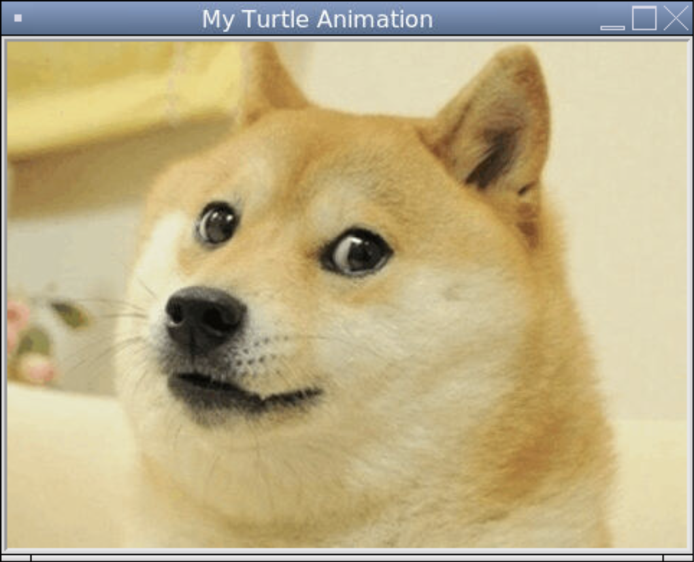

### Images in Turtle

We've been using the `shape()` function to change the shape from an arrow to a turtle. We can make our own custom shapes from image files as long as its a GIF (if it's a PNG or GIF, we have to convert it first). We can use this strategy to place an image on the window. 

```python
# Importing the turtle module
from turtle import *
from turtle import _CFG  # we need this to remove the scrollers

# Resizes the default canvas size to prevent scrollers
_CFG["canvwidth"] = 1 
_CFG["canvheight"] = 1

# Creates a window with the size 400 by 300 and sets the title
setup(400, 300)
title("My Turtle Animation")

# The image is turned into a shape and the turtle puts the image onto the window
addshape("doge.gif")
shape("doge.gif")

# Hides the turtle after they are done drawing
hideturtle()

# Keeps the program running after the drawing is complete
done()
```


