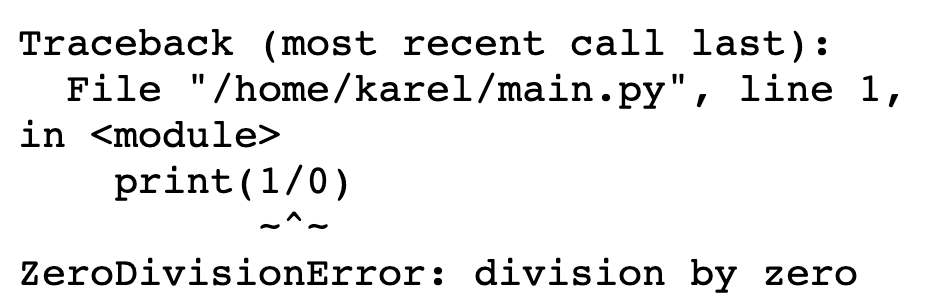

# [Link to video.](https://www.youtube.com/watch?v=d_zqnHYJsOU&list=PLVD25niNi0BkMe4nxXTL4vFED06M6ccpg)

### Error Handling

Whenever you run a program that has errors, you may have noticed that the console attempts to tells you what kind of error it is. 

For example, if you try to divide by zero, you get a message in the console saying that there was an error called `ZeroDivisionError`.



A **runtime error** or **runtime exception** is a problem that occurs while a program is running. When an error occurs in Python, we say that program **raises** an error. When this happens and your program doesn't **handle** it, the program terminates abruptly. We can handle errors using a `try`-`except` structure.

Here is an example of a function that handles a division by zero error.

```python
numerator = int(input("Enter a numerator: "))
denominator = int(input("Enter a denominator: "))

try:
    fraction = numerator/denominator
    print(f"The fraction {numerator}/{denominator} is approximately equal to {fraction}")
except:
    print("Your fraction has a zero by division error!")
```

The `try` block is run first. The program tries to run the lines in the block; if an error is raised and the rest of the block does not run. 

The `except` block runs only when an errror such as `ZeroDivisionError` has been raised. It "catches" the error and prevents the program from abruptly terminating and giving you an error message.

If we want an `except` block to catch only a specific type of error, we can do that like this:

```python
try:
    numerator = int(input("Enter a numerator: "))
    denominator = int(input("Enter an integer: "))
    fraction = numerator/denominator
    print(f"The fraction {numerator}/{denominator} is approximately equal to {fraction}")
except ZeroDivisionError:
    print("Your fraction has a zero by division error!")
except ValueError:
    print("You didn't enter two integers!")
except:
    print("Something unexpected went wrong.")
```

If want to know what error we got, we can catch an `Exception`, which is the generic name of all errors and store it in a variable using the keyword `as`.

```python
try:
    # try something here
    pass
except Exception as e:  # stores the error in the variable e
    print(f"Error message: {e}")
```
